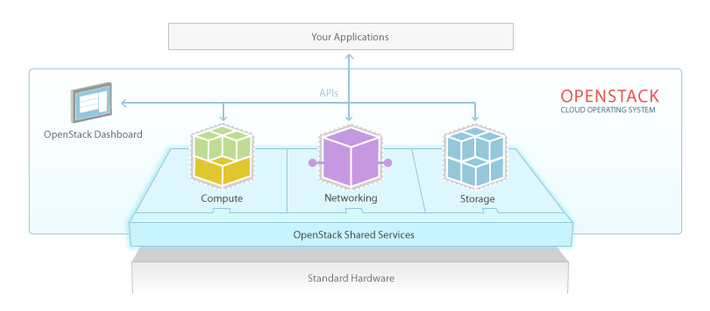

# Tổng quan về Hệ thống OpenStack

## 1. OpenStack là gì ?

OpenStack là một phần mềm mã nguồn mở, dùng để triển khai Cloud Computing, bao gồm `private cloud` và `public cloud`.

OpenStack là một hệ điều hành đám mây kiểm soát các nhóm tài nguyên tính toán, lưu trữ và mạng lớn trong toàn bộ trung tâm dữ liệu, tất cả được quản lý thông qua bảng điều khiển cho phép quản trị viên kiểm soát trong khi trao quyền cho người dùng của họ cung cấp tài nguyên thông qua giao diện web.

OpenStack nhắm đến mục đích thực hiện đơn giản, khả năng mở rộng lớn và một tính năng phong phú.

OpenStack cung cấp giải pháp IaaS thông qua nhiều dịch vụ bổ sung. Mỗi dịch vụ cung cấp API tạo điều kiện cho việc tích hợp này.

Trong đó:

- **Standard Harware**: Bộ phần cứng đều được ảo hóa để chia sẻ cho ứng dụng và người dùng.

- **OpenStack Shared Services**: OpenStack Sử dụng các APIs tạo nên các thành phần, module khác nhau nhưng trong hình chỉ minh họa các thành phần cơ bản: Dashboard, Compute, Networking, Storage, ...

- **Your Application**: Các ứng dụng mà bạn có nhu cầu sử dụng trên hệ thống OpenStack.

**Lưu ý**: OpenStack đã bao trùm cả lên phần ảo hóa, nó chính là trong khối `Compute` trong hình ảnh trên. Do vậy, không nên nhầm sang khía cảnh ảo hóa.

Các phiên bản của OpenStack được đặt tên bắt đầu với chữ cái lượt lượt A, B, C, D, ... trên [Trang chủ](https://releases.openstack.org/)

### Một số thông tin vắn tắt về OpenStack

OpenStack là một dự án mã nguồn mở để triển khai Private cloud, Public cloud. Nó bao gồm nhiều thành phần (project con) do các công ty, tổ chức, lập trình viên tự nguyện xây dựng và phát triển. Có 3 nhóm chính tham gia: Nhóm điều hành, nhóm phát triển và nhóm người dùng.
OpenStack hoạt động theo hướng mở: (Open) Công khai lộ trình phát triển, (Open) công khai mã nguồn …

Tháng 10/2010 Racksapce và NASA công bố phiên bản đầu tiên của OpenStack, có tên là OpenStack Austin, với 2 thành phần chính ( project con) : Compute (tên mã là Nova) và Object Storage (tên mã là Swift)

Các phiên bản OpenStack có chu kỳ 6 tháng. Tức là 6 tháng một lần sẽ công bố phiên bản mới với các tính năng bổ sung.

## 2. Thành phần

OpenStack không phải là một dự án đơn lẻ mà là một nhóm các dự án nguồn mở nhằm mục đích cung cấp các dịch vụ cloud hoàn chỉnh. OpenStack chứa nhiều thành phần:

- **OpenStack compute** (code-name `Nova`): là module quản lý và cung cấp máy ảo. Tên phát triển của nó `Nova`. Nó hỗ trợ nhiều hypervisors gồm KVM, QEMU, LXC, XenServer... Compute là một công cụ mạnh mẽ mà có thể điều khiển toàn bộ các công việc: networking, CPU, storage, memory, tạo, điều khiển và xóa bỏ máy ảo, security, access control. Bạn có thể điều khiển tất cả bằng lệnh hoặc từ giao diện dashboard trên web.

- **OpenStack Glance** (code-name `Glance`): là OpenStack Image Service, quản lý các disk image ảo. Glance hỗ trợ các ảnh Raw, Hyper-V (VHD), VirtualBox (VDI), Qemu (qcow2) và VMWare (VMDK, OVF). Bạn có thể thực hiện: cập nhật thêm các virtual disk images, cấu hình các public và private image và điều khiển việc truy cập vào chúng, và tất nhiên là có thể tạo và xóa chúng.

- **OpenStack Object Storage** (code-name `Swift`): dùng để quản lý lưu trữ. Nó là một hệ thống lưu trữ phân tán cho quản lý tất cả các dạng của lưu trữ như: archives, user data, virtual machine image … Có nhiều lớp redundancy và sự nhân bản được thực hiện tự động, do đó khi có node bị lỗi thì cũng không làm mất dữ liệu, và việc phục hồi được thực hiện tự động.

- **Identity Server** (code-name `Keystone`): quản lý xác thực cho user và projects.

- **OpenStack Network** (code-name `Neutron`): là thành phần quản lý network cho các máy ảo. Cung cấp chức năng network as a service. Đây là hệ thống có các tính chất pluggable, scalable và API-driven.

- **OpenStack dashboard** (code-name `Horizon`): cung cấp cho người quản trị cũng như người dùng giao diện đồ họa để truy cập, cung cấp và tự động tài nguyên cloud. Việc thiết kế có thể mở rộng giúp dễ dàng thêm vào các sản phẩm cũng như dịch vụ ngoài như billing, monitoring và các công cụ giám sát khác.