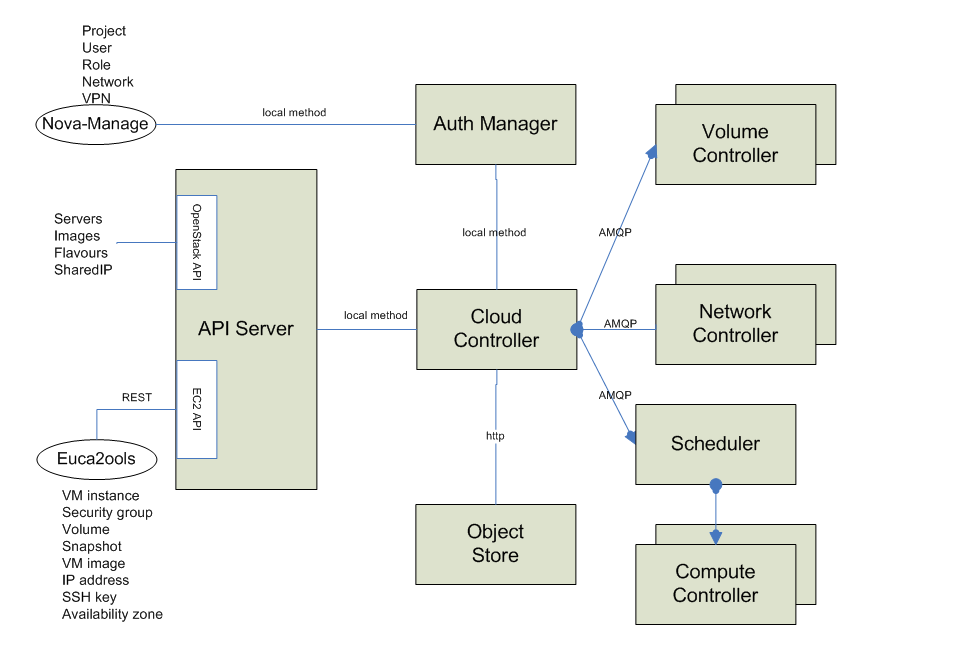
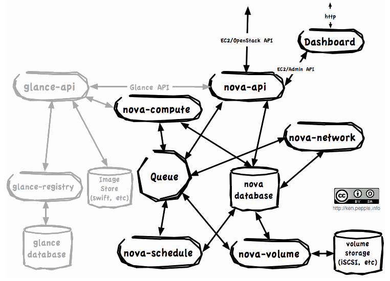
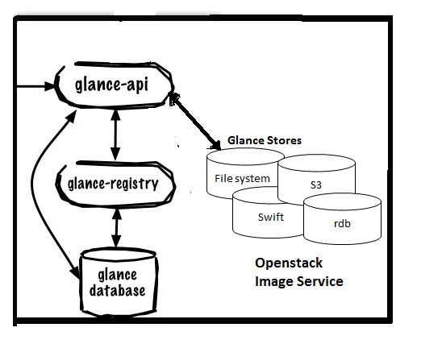
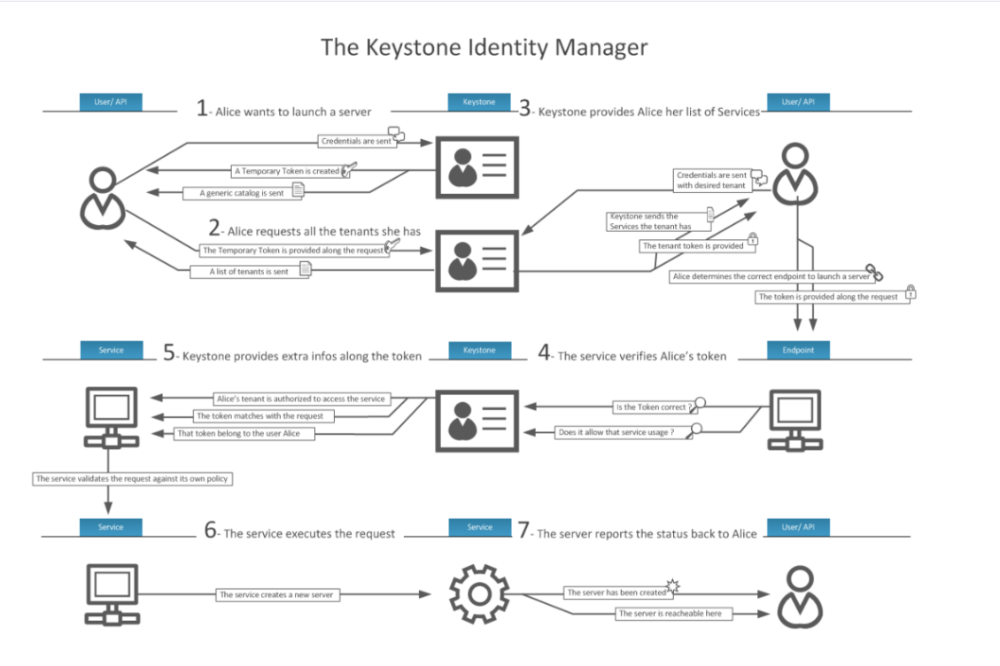

# Các thành phần và cấu trúc của Openstack

OpenStack là một nền tảng điện toán đám mây mã nguồn mở được tạo thành bởi nhiều services khác nhau. Mỗi service sẽ đảm nhận một chức năng cụ thể và chúng có mối liên hệ mật thiết với nhau.

## 1. Các project thành phần

|Service|Project name|Description|
|-------|------------|-----------|
|Dashboard|Horizon|Cung cấp giao diện trên nền tảng web để người dùng tương tác với các dịch vụ khác của OpenStack ví dụ như tạo VM, gán địa chỉ IP, cấu hình kiểm soát truy cập...|
|Compute service|Nova|Quản lí các máy ảo trong môi trường OpenStack. Nó có trách nhiệm khởi tạo, lên lịch và gỡ bỏ các VM theo yêu cầu
|Networking|Neutron|Cung cấp khả năng kết nối mạng cho các dịch vụ khác. Cung cấp API cho người dùng tạo ra network và quản lí chúng. Nó có kiến trúc linh hoạt hỗ trợ hầu hết các công nghệ về networking.|
|Object Storage|Swift|Lưu trữ và truy xuất các dữ liệu phi cấu trúc thông qua RESTful, HTTP based API. Nó có khả năng chịu lỗi cao nhờ cơ chế sao chép và mở rộng. Quy trình thực hiện của Swift không giống với file server.|
|Block Storage|Cinder|Cung cấp các storage để chạy máy ảo. Kiến trúc linh hoạt của nó cho phép người dùng khởi tạo và quản lí các thiết bị lưu trữ.|
|Identity service|Keystone|Cung cấp dịch vụ xác thực và ủy quyền cho các dịch vụ khác. Cung cấp một danh mục các thiết bị đầu cuối cho tất cả các dịch vụ OpenStack.|
|Image Service|Glance|Lưu trữ và truy xuất các ổ đĩa của máy ảo. Compute sẽ sử dụng dịch vụ này trong suốt quá trình khởi tạo và chạy máy ảo|

Ngoài những dịch vụ chính kể trên, OpenStack còn có thêm một vài dịch vụ khác như **Telemetry**, **Orchestration**, **Database** và **Data Processing service**.

## 2. Kiến trúc của OpenStack

Mô hình trên khá phức tạp, ta có thể tìm hiểu qua mô hình OpenStack được phân chia theo các Layers như sau:

Trong mô hình này, OpenStack có 4 layers:

- **Layer 1 - Basic Compute Infrastructure**: cơ sở hạ tầng tính toán cơ bản

- **Layer 2 - Extended Infrastructure**: cơ sở hạ tầng mở rộng

- **Layer 3 - Optional Enhancements**: tầng cải tiến tùy chọn

- **Layer 4 - Consumption Services**: dịch vụ tiêu thụ

## 3. Tổng quan các services thành phần trong Openstack

### 3.1. Nova - Compute service

Được dùng để khởi tạo và quản lí hệ thống điện toán đám mây. Đây là thành phần chính trong hệ thống Infrastructure-as-a-Service (IaaS). Các modules chính của nó được xây dựng bằng Python.

OpenStack Compute giao tiếp với OpenStack Identity để xác thực, OpenStack Image để lấy ổ cứng cài đặt, OpenStack Dashboard để lấy giao diện người dùng và người quản trị. OpenStack Compute có thể mở rộng theo chiều ngang tùy theo từng phần cứng, nó cũng có thể download images để tạo máy ảo.

OpenStack Compute hỗ trợ rất nhiều Hypervisor bao gồm KVM (libvirt/QEMU), ESXi from VMware, Hyper-V from Microsoft và XenServer.

### Tùy vào mức độ hỗ trợ và số hypervisor này được chia làm 3 nhóm:

- Nhóm A: libvirt (qemu/KVM on x86). Được hỗ trợ đầy đủ nhất, việc kiểm thử bao gồm unit test và functional testing.

- Nhóm B: Hyper-V, VMware, XenServer 6.2. Được hỗ trợ ở mức trung bình, việc kiểm thử bao gồm unit test và functional testing cung cấp bởi một hệ thống bên ngoài.

- Nhóm C: baremetal, docker , Xen via libvirt, LXC via libvirt. Đây là nhóm ít được hỗ trợ nhất. Nên cẩn thẩn khi sử dụng chúng.

### Các thành phần cấu thành lên Nova service:

Dưới đây là mô hình mô tả mối quan hệ giữa các thành phần với nhau:

- Cloud Controller: đại diện cho trạng thái toàn cục và tương tác với các component khác

- API Server: có thể coi như các Web services cho cloud controller

- Compute Controller: cung cấp tài nguyên máy chủ tính toán

- Object Store: cung cấp dịch vụ lưu trữ

- Auth Manager: cung cấp dịch vụ xác thực và ủy quyền

- Volume Controller: cung cấp các khối lưu trữ bền vững và nhanh chóng cho các computer server

- Network controller: cung cấp mạng ảo cho phép các compute server tương tác với nhau và với public network

- Scheduler lựa chọn compute controller phù hợp nhất để host một instance (máy ảo)

- The queue : Đóng vai trò trung tâm truyền thông điệp giữa các daemons. Thông thường được dùng với RabbitMQ, nó cũng có thể sử dụng bất cứ AMQP message queue nào khác ví dụ như Apache Qpid (used by Red Hat OpenStack) và ZeroMQ.

- SQL database: Lưu trữ trạng thái trong quá trình cloud khởi tạo và chạy, nó bao gồm:

    - Available instance types: các loại instance có sẵn

    - Instances in use: các instance đang sử dụng

    - Available networks: các network có sẵn

    - Projects: các project

Theo lí thuyết thì OpenStack Compute hỗ trợ bất cứ database nào mà SQLAlchemy hỗ trợ. Thông thường người ta sử dụng SQLite3, MySQL, MariaDB, và PostgreSQL.

Trong OpenStack, các thành phần kể trên có những tên gọi khác nhau ví dụ như: nova-api, nova-scheduler, nova-conductor...

- End users (DevOps, Developers and even other OpenStack components): Sử dụng nova-api để giao tiếp với OpenStack Nova

- Các OpenStack Nova daemons trao đổi thông tin qua queue (chứa các hành động) và database (chứa các thông tin) để thực thi các yêu cầu của api

- OpenStack Glance về cơ bản là một phần hoàn toàn tách biệt, OpenStack Nova giao tiếp với nó thông qua Glance API.

### 3.2. Glance - Image service

**Glance** cho phép người dùng tìm kiếm, đăng kí và di chuyển các disk image của máy ảo. Nó sung cấp giao diện web đơn giản (REST: Representational State Transfer) cho phép người dùng truy xuất metadata của image trong các VM. Glance làm việc trực tiếp với Nova để hỗ trợ cho việc tạo máy ảo, nó cũng giao tiếp với Keystone để xác thực API.

OpenStack Image service là trung tâm của **Infrastructure-as-a-Service (IaaS)**. Nó tiếp nhận các API requests cho ổ đĩa, server images hoặc metadata. Nó cũng hỗ trợ các storage lưu trữ khác nhau bao gồm OpenStack Object Storage.

**Các thành phần chính của OpenStack Image service:**

- **glance-api**: Chấp thuận các API calls cho việc tìm kiếm, vận chuyển và lưu trữ.

- **glance-registry**: Lưu, xử lí và truy vấn metadata về các images. Metadata bao gồm các thông tin về image như là kích cỡ và loại.

- **database**: Lưu trữ metadata, MySQL hoặc SQLite thường được sử dụng.

- **Storage repository** : Hỗ trợ nhiều loại kho lưu trữ thông thường bao gồm: RADOS block devices, VMware datastore, HTTP và Swift.

- **Metadata definition service**: API cho nhà phân phối, quản trị và người dùng để tự định nghĩa metadata của riêng họ.

**Danh sách các định dạng ổ đĩa và container được hỗ trợ bao gồm:**

- **Disk Format**: Disk format của một image máy ảo là định dạng của disk image, bao gồm:

    - raw: là định dạng ảnh đĩa phi cấu trúc

    - vhd: là định dạng ảnh đĩa chung sử dụng bởi các công nghệ VMware, Xen, Microsoft, VirtualBox, etc.

    - vmdk: định dạng ảnh đĩa chung hỗ trợ bởi nhiều công nghệ ảo hóa khác nhau (điển hình là VMware)

    - vdi: định dạng ảnh đĩa hỗ trợ bởi VirtualBox và QEMU emulator

    - iso: định dạng cho việc lưu trữ dữ liệu của ổ đĩa quang

    - qcow2: hỗ trợ bởi QEMU và có thể ở rộng động, hỗ trợ copy on write

    - aki: Amazon kernel image

    - ari: Amazon ramdisk image

    - ami: Amazon machine image

- **Container Format:**

    - bare: định dạng này xác định rằng không có container hoặc metadata cho image

    - ovf: định dạng OVF container

    - aki: xác định Amazon kernel image lưu trữ trong **Glance**

    - ami: Xác định Amazon ramdisk image lưu trữ trong **Glance**

    - ova: xác định file OVA tar lưu trữ trong **Glance**

### 3.3. Keystone - Identity service

**Cung cấp dịch vụ xác thực cho toàn bộ hạ tầng OpenStack**

- Theo dõi người dùng và quyền hạn của họ.

- Cung cấp một catalog của các dịch vụ đang sẵn sàng với các API endpoints để truy cập các dịch vụ đó.

**Identity service** chính là dịch vụ đầu tiên mà người dùng tương tác. Một khi đã được xác thực, người dùng có thể dùng nó để tương tác với các dịch vụ khác. Bên cạnh đó, các dịch vụ khác của **OpenStack** cũng sử dụng dịch vụ xác thực để chắc chắn về danh tính người sử dụng. Dịch vụ này có thể đi kèm với một vài hệ thống quản lí user như LDAP.

Về mặt bản chất, **Keystone** cung cấp chức năng xác thực và ủy quyền cho các phần tử trong **OpenStack**. Người dùng khai báo chứng thực với **Keystone** và dựa trên kết quả của tiến trình xác thực, nó sẽ gán "role" cùng với một token xác thực cho người dùng. Token là một dạng thông tin của một user, token được sinh ra khi ta sử dụng username,password đúng để xác thực với keystone. Khi đó user sẽ dùng token này để truy cập vào **Openstack** API. "Role" này mô tả quyền hạn cũng như vai trò trong thực hiện việc vận hành **OpenStack**.

**"User" trong Keystone có thể là:**

- Con người

- Dịch vụ (Nova, Cinder, neutron, etc.)

- Endpoint (là địa chỉ có khả năng truy cập mạng như URL, RESTful API, etc.)

User có thể được tập hơp lại thành 1 tenant, tenant này có thể là project, nhóm hoặc tổ chức.

Keystone gán một tenant và một role cho user. Một user có thể có nhiều role trong các tenants khác nhau. Tiến trình xác thực có thể biểu diễn như sau:

