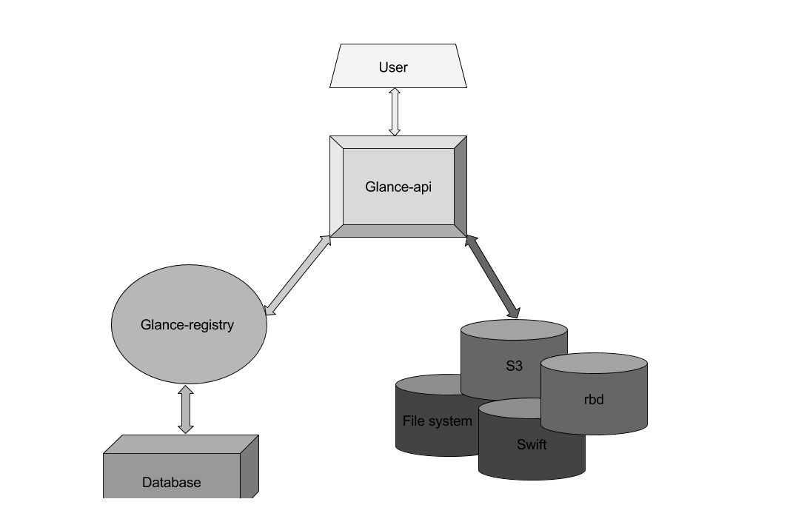
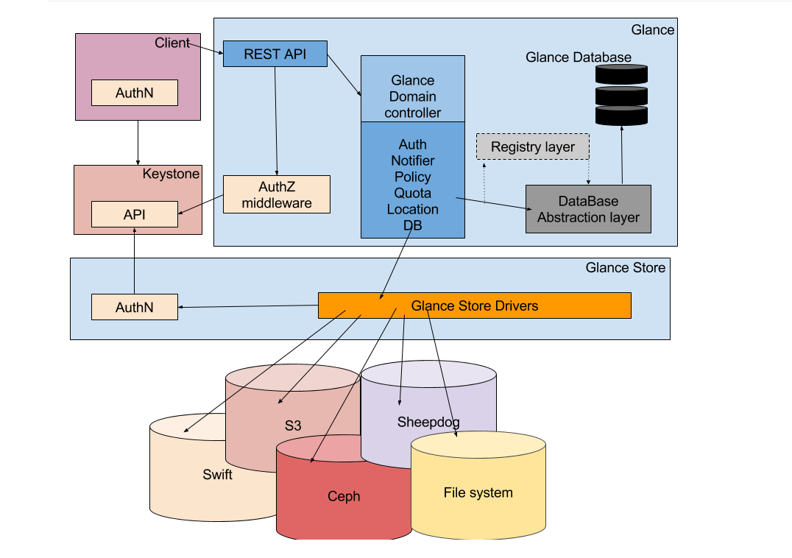

# Tổng quan về Openstack Image Service - Glance

## 1. Giới thiệu

**Openstack Image service** là dịch vụ trung tâm trong kiến trúc IaaS. Hiểu đơn giản thì nó là trung tâm quản lý các image.

Nó chấp nhận các API request cho disk hoặc server image và metadata từ phía người dùng hoặc từ Compute service. Nó cũng hỗ trợ lưu trữ disk hoặc server image trên rất nhiều loại repository, bao gồm cả OPS Object Storage - Swift

Trong **Glance**, các images được lưu trữ giống như các template. Các Template này sử dụng để vận hành máy ảo mới. **Glance** là giải pháp để quản lý các image trên cloud. Nó cũng có thể lấy bản snapshots từ các máy ảo đang chạy để thực hiện dự phòng cho các VM và trạng thái các máy ảo đó.

**Glance** được thiết kế để trở thành dịch vụ độc lập, đáp ứng các vấn đề quản lý số lượng virtual disk images lớn, đáp ứng như cầu dịch vụ cloud.

## 2. Các thành phần của Glance

Glance có các thành phần sau:

- **glance-api** : tiếp nhận lời gọi API để tìm kiếm, thu thập và lưu trữ image

- **glance-registry**: thực hiện tác vụ lưu trữ, xử lý và thu thập metadata của images. - Metadata bao gồm các thông tin như kích thước và loại image.

- **database**: cơ sở dữ liệu lưu trữ metadata của image

- **storage repository** : Tích hợp các thành phần OpenStack:

    - **File system**: lưu trữ các image của các máy ảo trong hệ thống tệp tin thông thường theo mặc định, hỗ trợ đọc ghi các các image file dễ dàng vào hệ thống tệp tin. (Mặc định)

    - **Object Storage**: Hệ thống lưu trữ do OpenStack Swift cung cấp lưu trữ các image dưới dạng các object.

    - **BlockStorage**: Hệ thống lưu trữ do OpenStack Cinder cung cấp, lưu trữ các image dưới dạng khối. RADOS Block Device(RBD): Lưu trữ các image trong Ceph, sử dụng giải pháp RBD của Ceph.

    - **HTTP**: OpenStack Image Service có thể đọc các vitual machine service có sẵn trên internet sử dụng giao thức HTTP. Lưu trữ này chỉ có thể đọc.

- **Metadata definition service**:

    - API cho nhà cung cấp, admin, service, user định nghĩa custom metadata.

## 3. Kiến trúc của Glance

- Glance có kiến trúc client-server cung cấp REST API cho user để thông qua đó gửi yêu cầu tới server.

- Glance Domain Controller quản lí các hoạt động bên trong. Các hoạt động được chia ra thành các tầng khác nhau. Mỗi tầng thực hiện một chức năng riêng biệt.

- Glane store là lớp giao tiếp giữa glane và storage backend ở ngoài glane hoặc local filesystem và nó cung cấp giao diện thống nhất để truy cập. Glance sử dụng SQL central Database để truy cập cho tất cả các thành phần trong hệ thống.

- Glance bao gồm một số thành phần sau:

    - **Client**: Bất kỳ ứng dụng nào sử dụng Glance server đều được gọi là client.

    - **REST API**: dùng để gọi đến các chức năng của Glance thông qua REST.

    - **Database Abstraction Layer (DAL)**: một API để thống nhất giao tiếp giữa Glance và database.

    - **Glance Domain Controller**: là middleware thực hiện các chức năng chính của Glance là: authorization, notifications, policies, database connections.

    - **Glance Store**: Giao diện tích hợp giữa Glance và các data store.

    - **Registry Layer**: Layer không bắt buộc để tổ chức giao tiếp mang tính bảo mật giữa domain và DAL nhờ việc sử dụng một dịch vụ riêng biệt.