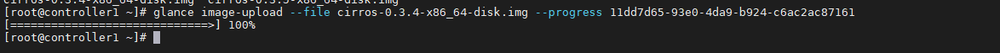

# Các lệnh thường sử dụng với Glance

Có thể thao tác với Glance CLI bằng 2 cách:

- Glance CLI

- Openstack Client CLI

## 1. Glance CLI

### 1.1 List image

```
glance image-list
+--------------------------------------+-------------+
| ID                                   | Name        |
+--------------------------------------+-------------+
| e3a3c360-ccef-44a9-8108-d54f94f4888f | cirros-ceph |
+--------------------------------------+-------------+
```

### 1.2. Tạo 1 image

```
glance image-create [--architecture <ARCHITECTURE>]
                           [--protected [True|False]] [--name <NAME>]
                           [--instance-uuid <INSTANCE_UUID>]
                           [--min-disk <MIN_DISK>] [--visibility <VISIBILITY>]
                           [--kernel-id <KERNEL_ID>]
                           [--tags <TAGS> [<TAGS> ...]]
                           [--os-version <OS_VERSION>]
                           [--disk-format <DISK_FORMAT>]
                           [--os-distro <OS_DISTRO>] [--id <ID>]
                           [--owner <OWNER>] [--ramdisk-id <RAMDISK_ID>]
                           [--min-ram <MIN_RAM>]
                           [--container-format <CONTAINER_FORMAT>]
                           [--property <key=value>] [--file <FILE>]
                           [--progress]
```

Ví dụ:

```
[root@controller1 ~]# openstack image create "cirros-ceph" \
> --file cirros-0.3.4-x86_64-disk.img \
> --disk-format qcow2 --container-format bare \
> --public

+------------------+----------------------------------------------------------------------------------------------------------+
| Field            | Value                                                                                                    |
+------------------+----------------------------------------------------------------------------------------------------------+
| checksum         | ee1eca47dc88f4879d8a229cc70a07c6                                                                         |
| container_format | bare                                                                                                     |
| created_at       | 2021-08-27T00:49:35Z                                                                                     |
| disk_format      | qcow2                                                                                                    |
| file             | /v2/images/e3a3c360-ccef-44a9-8108-d54f94f4888f/file                                                     |
| id               | e3a3c360-ccef-44a9-8108-d54f94f4888f                                                                     |
| min_disk         | 0                                                                                                        |
| min_ram          | 0                                                                                                        |
| name             | cirros-ceph                                                                                              |
| owner            | c52a15d316c54dc4931e1c8d52686b98                                                                         |
| properties       | direct_url='rbd://da1140f1-67f1-4f44-96a2-72d65dcb46d2/images/e3a3c360-ccef-44a9-8108-d54f94f4888f/snap' |
| protected        | False                                                                                                    |
| schema           | /v2/schemas/image                                                                                        |
| size             | 13287936                                                                                                 |
| status           | active                                                                                                   |
| tags             |                                                                                                          |
| updated_at       | 2021-08-27T00:49:39Z                                                                                     |
| virtual_size     | None                                                                                                     |
| visibility       | public                                                                                                   |
+------------------+----------------------------------------------------------------------------------------------------------+
```

### 1.3. Show image

```
glance image-show [--human-readable] [--max-column-width <integer>] <IMAGE_ID>
```

Ví dụ:

```
glance image-show e3a3c360-ccef-44a9-8108-d54f94f4888f

+------------------+----------------------------------------------------------------------------------+
| Property         | Value                                                                            |
+------------------+----------------------------------------------------------------------------------+
| checksum         | ee1eca47dc88f4879d8a229cc70a07c6                                                 |
| container_format | bare                                                                             |
| created_at       | 2021-08-27T00:49:35Z                                                             |
| direct_url       | rbd://da1140f1-67f1-4f44-96a2-72d65dcb46d2/images/e3a3c360-ccef-                 |
|                  | 44a9-8108-d54f94f4888f/snap                                                      |
| disk_format      | qcow2                                                                            |
| id               | e3a3c360-ccef-44a9-8108-d54f94f4888f                                             |
| min_disk         | 0                                                                                |
| min_ram          | 0                                                                                |
| name             | cirros-ceph                                                                      |
| owner            | c52a15d316c54dc4931e1c8d52686b98                                                 |
| protected        | False                                                                            |
| size             | 13287936                                                                         |
| status           | active                                                                           |
| tags             | []                                                                               |
| updated_at       | 2021-08-27T00:49:39Z                                                             |
| virtual_size     | None                                                                             |
| visibility       | public                                                                           |
+------------------+----------------------------------------------------------------------------------+
```

### 1.4. Upload image

```
glance image-upload [--file <FILE>] [--size <IMAGE_SIZE>] [--progress] <IMAGE_ID>
```

Để upload, ta cần có 1 image rỗng trước. Tạo image rỗng :

```
glance image-create --name cirros-upload --container-format bare --disk-format qcow2

+------------------+--------------------------------------+
| Property         | Value                                |
+------------------+--------------------------------------+
| checksum         | None                                 |
| container_format | bare                                 |
| created_at       | 2021-08-27T03:04:55Z                 |
| disk_format      | qcow2                                |
| id               | 11dd7d65-93e0-4da9-b924-c6ac2ac87161 |
| min_disk         | 0                                    |
| min_ram          | 0                                    |
| name             | cirros-upload                        |
| owner            | c52a15d316c54dc4931e1c8d52686b98     |
| protected        | False                                |
| size             | None                                 |
| status           | queued                               |
| tags             | []                                   |
| updated_at       | 2021-08-27T03:04:55Z                 |
| virtual_size     | None                                 |
| visibility       | shared                               |
+------------------+--------------------------------------+
```

```
glance image-upload --file cirros-0.3.4-x86_64-disk.img --progress 11dd7d65-93e0-4da9-b924-c6ac2ac87161
```



### 1.6. Thay đổi trạng thái image

#### Deactive image:

```
glance image-deactivate <IMAGE_ID>
```

Ví dụ:

```
glance image-deactivate 11dd7d65-93e0-4da9-b924-c6ac2ac87161

openstack image list
+--------------------------------------+---------------+-------------+
| ID                                   | Name          | Status      |
+--------------------------------------+---------------+-------------+
| e3a3c360-ccef-44a9-8108-d54f94f4888f | cirros-ceph   | active      |
| 11dd7d65-93e0-4da9-b924-c6ac2ac87161 | cirros-upload | deactivated |
+--------------------------------------+---------------+-------------+
```


### 1.7. Active image

```
glance image-reactivate <IMAGE_ID>
```

Active lại image vừa deactivate ở trên:

```
glance image-reactivate 11dd7d65-93e0-4da9-b924-c6ac2ac87161

openstack image list
+--------------------------------------+---------------+--------+
| ID                                   | Name          | Status |
+--------------------------------------+---------------+--------+
| e3a3c360-ccef-44a9-8108-d54f94f4888f | cirros-ceph   | active |
| 11dd7d65-93e0-4da9-b924-c6ac2ac87161 | cirros-upload | active |
+--------------------------------------+---------------+--------+
```

### 1.8. Xóa image

```
glance image-delete <IMAGE_ID> [<IMAGE_ID> ...]
```

Ví dụ:

```
glance image-delete 11dd7d65-93e0-4da9-b924-c6ac2ac87161

openstack image list
+--------------------------------------+-------------+--------+
| ID                                   | Name        | Status |
+--------------------------------------+-------------+--------+
| e3a3c360-ccef-44a9-8108-d54f94f4888f | cirros-ceph | active |
+--------------------------------------+-------------+--------
```

**Lưu ý:** Có thể xóa nhiều image trong cùng một câu lệnh

## 2. Openstack CLI

### 2.1. List image

```
openstack image list
```

Có thể dùng kèm với lệnh `grep` để lọc. Ví dụ:

```
openstack image list | grep 'cirros'
```

### 2.2. Show image

```
openstack image show [--human-readable] <ID | image_name>
```

- `--human-readable` : định dạng kích thước của image dễ đọc


### 2.3. Tạo image

```
openstack image create
    [--id <id>]
    [--container-format <container-format>]
    [--disk-format <disk-format>]
    [--min-disk <disk-gb>]
    [--min-ram <ram-mb>]
    [--file <file> | --volume <volume>]
    [--force]
    [--sign-key-path <sign-key-path>]
    [--sign-cert-id <sign-cert-id>]
    [--protected | --unprotected]
    [--public | --private | --community | --shared]
    [--property <key=value>]
    [--tag <tag>]
    [--project <project>]
    [--import]
    [--project-domain <project-domain>]
    <image-name>
```

Ví dụ:

```
openstack image create "cirros-2" --file cirros-0.3.5-x86_64-disk.img --disk-format qcow2 --container-format bare --public
```

### 2.4. Xóa image

```
openstack image delete <ID image | image_name>
```


### 2.5. Update thông tin image

```
openstack image set
    [--name <name>]
    [--min-disk <disk-gb>]
    [--min-ram <ram-mb>]
    [--container-format <container-format>]
    [--disk-format <disk-format>]
    [--protected | --unprotected]
    [--public | --private | --community | --shared]
    [--property <key=value>]
    [--tag <tag>]
    [--architecture <architecture>]
    [--instance-id <instance-id>]
    [--kernel-id <kernel-id>]
    [--os-distro <os-distro>]
    [--os-version <os-version>]
    [--ramdisk-id <ramdisk-id>]
    [--deactivate | --activate]
    [--project <project>]
    [--project-domain <project-domain>]
    [--accept | --reject | --pending]
    <image>
```

### 2.6. Thêm project cho image

```
openstack image add project
    [--project-domain <project-domain>]
    <image>
    <project>
```

- `--project-domain <project-domain>` : domain (tên hoặc ID)

- `<image>` : image ở trạng thái shared (tên hoặc ID)

- `<project>` : project (tên hoặc ID)

Để thêm project cho image, thì image phải ở trạng thái shared

- Tạo 1 image dạng share:

```
openstack image create "cirros-3" --file cirros-0.3.5-x86_64-disk.img --disk-format qcow2 --container-format bare --shared
```

- Thêm project cho image:

```
openstack image add project \
cirros-3 \
demo
+------------+--------------------------------------+
| Field      | Value                                |
+------------+--------------------------------------+
| created_at | 2021-08-27T03:16:14Z                 |
| image_id   | 2d76f4a5-0c90-4331-a160-ed8e72e9c716 |
| member_id  | d9cb9249dfb14c589a5aef4544a67f39     |
| schema     | /v2/schemas/member                   |
| status     | pending                              |
| updated_at | 2021-08-27T03:16:14Z                 |
+------------+--------------------------------------+
```

### 2.7. Xóa Project cho image

Để remove, ta đổi `add` -> `remove`

```
openstack image remove project
    [--project-domain <project-domain>]
    <image>
    <project>
```