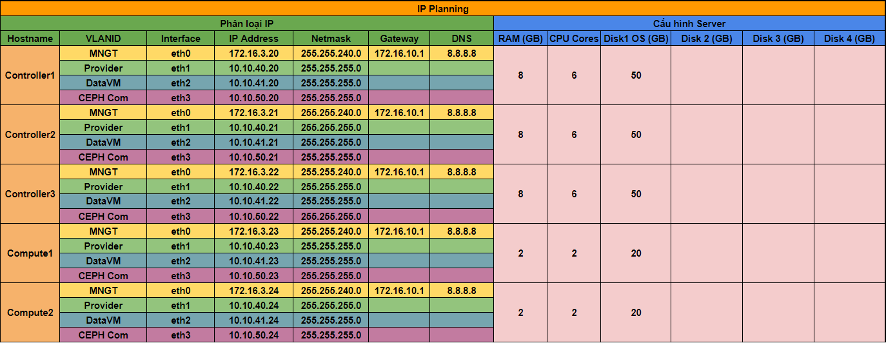

# Cài đặt OpenStack High Availability - Kết hợp với CEPH

## Phần 1. Chuẩn bị

### 1. Tài nguyên

Mô hình bao gồm:

- 3 node Controller.

- 2 node Compute.

- 3 node CEPH.

### 2. Quy hoạch IP

- Mô hình Quy hoạch IP cho Cụm OPS: 3 node Controller + 2 node Compute:

- Mô hình Quy hoạch IP cho Cụm CEPH:

## Phần 2. Triển khai MariaDB

Triển khai cài đặt trên 3 Node Controller.

Cấu hình mô hình Galare 3 Node - tham khảo [tại đây](https://github.com/quanganh1996111/ha-cluster-nhanhoa/blob/main/2-cluster/5-install-galare-3node-centos7.md)

[Các bước thực hiện]