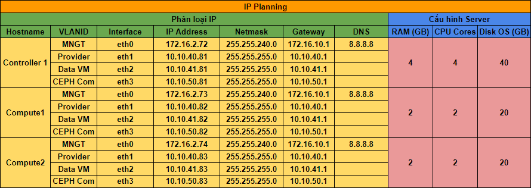

# Cài đặt OpenStack Queens không có HA trên CentOS 7 sử dụng Script 

## Phần 1. Chuẩn bị

### 1. IP Planning



## Phần 2. Cấu hình trên Node controller

### 1. Cấu hình cơ bản

- [Cấu hình IP](https://github.com/quanganh1996111/openstack/blob/main/install-openstack/docs/1-install-openstack-manual.md#c%E1%BA%A5u-h%C3%ACnh-ip)

- [Cấu hình các mode sysctl](https://github.com/quanganh1996111/openstack/blob/main/install-openstack/docs/1-install-openstack-manual.md#c%E1%BA%A5u-h%C3%ACnh-c%C3%A1c-mode-sysctl)

### 2. Tải Script cài đặt OPS

#### 2.1. Tải Script

```
yum -y install git
 git clone https://github.com/domanhduy/openstack-tools.git

 mv openstack-tools/scripts/OpenStack-Queens-No-HA/CentOS7 /root/

 cd CentOS7
 chmod +x *.sh
```

**Lưu ý**: Nếu muốn sửa các IP thì sử dụng VI hoặc VIM để sửa, cần lưu ý tên NICs và địa chỉ IP cần phải tương ứng (trong này này tên NICs là eth0 -> eth3)

- Nếu cần thiết thì cài ứng dụng byobu để khi các phiên ssh bị mất kết nối thì có thể sử dụng lại (để sử đụng lại thì cần ssh vào và gõ lại lệnh byobu)

```
sudo yum -y install epel-release
sudo yum -y install byobu
```

- Gõ lệnh byobu

```
byobu
```

#### 2.2. Chỉnh sửa IP

Để chỉnh sửa IP tương ứng với địa chỉ IP của các node `controller` hay `compute1`, `compute2`

Chỉnh sửa trong file `/root/CentOS7/config.cfg` với thông số hostname, IP của các node, tương ứng của các node.

```
### Hostname cho cac may CONTROLLER
CTL1_HOSTNAME=controller1
COM1_HOSTNAME=compute1
COM2_HOSTNAME=compute2
CINDER1_HOSTNAME=cinder1
SWIFT1_HOSTNAME=swift1
SWIFT2_HOSTNAME=swift2


## IP Address CONTROLLER
CTL1_IP_NIC1=172.16.2.72
CTL1_IP_NIC2=10.10.40.81
CTL1_IP_NIC3=10.10.41.81
CTL1_IP_NIC4=10.10.50.81

## IP Address COMPUTE1
COM1_IP_NIC1=172.16.2.73
COM1_IP_NIC2=10.10.40.82
COM1_IP_NIC3=10.10.41.82
COM1_IP_NIC4=10.10.50.82


## IP Address COMPUTE2
COM2_IP_NIC1=172.16.2.74
COM2_IP_NIC2=10.10.40.83
COM2_IP_NIC3=10.10.41.83
COM2_IP_NIC4=10.10.50.83
```

#### 2.3. Thực thi script noha_ctl_prepare.sh

Lưu ý, lúc này cửa sổ nhắc lệnh đang ở thư mục `/root/CentOS7/` của node `controller1`

- Thực thi script `noha_ctl_prepare.sh`

```
bash noha_ctl_prepare.sh
```

**Lưu ý**: Khi tiến hành cài đặt sẽ yêu cầu mật khẩu root SSH của các node `controller` và `compute` nên cần để ý để tránh trường hợp tưởng scripts chạy tự động sẽ mất thời gian.