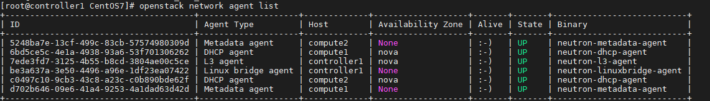

# Cài đặt OpenStack Queens không có HA trên CentOS 7 sử dụng Script 

## Phần 1. Chuẩn bị

### 1. IP Planning


## Phần 2. Cấu hình trên Node controller

### 1. Cấu hình cơ bản

- [Cấu hình IP](https://github.com/quanganh1996111/openstack/blob/main/install-openstack/docs/1-install-openstack-manual.md#c%E1%BA%A5u-h%C3%ACnh-ip)

- [Cấu hình các mode sysctl](https://github.com/quanganh1996111/openstack/blob/main/install-openstack/docs/1-install-openstack-manual.md#c%E1%BA%A5u-h%C3%ACnh-c%C3%A1c-mode-sysctl)

### 2. Tải Script cài đặt OPS

#### 2.1. Tải Script

```
yum -y install git
 git clone https://github.com/domanhduy/openstack-tools.git

 mv openstack-tools/scripts/OpenStack-Queens-No-HA/CentOS7 /root/

 cd CentOS7
 chmod +x *.sh
```

**Lưu ý**: Nếu muốn sửa các IP thì sử dụng VI hoặc VIM để sửa, cần lưu ý tên NICs và địa chỉ IP cần phải tương ứng (trong này này tên NICs là eth0 -> eth3)

- Nếu cần thiết thì cài ứng dụng byobu để khi các phiên ssh bị mất kết nối thì có thể sử dụng lại (để sử đụng lại thì cần ssh vào và gõ lại lệnh byobu)

```
sudo yum -y install epel-release
sudo yum -y install byobu
```

- Gõ lệnh byobu

```
byobu
```

#### 2.2. Chỉnh sửa IP

Để chỉnh sửa IP tương ứng với địa chỉ IP của các node `controller` hay `compute1`, `compute2`

Chỉnh sửa trong file `/root/CentOS7/config.cfg` với thông số hostname, IP của các node, tương ứng của các node.

```
### Hostname cho cac may CONTROLLER
CTL1_HOSTNAME=controller1
COM1_HOSTNAME=compute1
COM2_HOSTNAME=compute2
CINDER1_HOSTNAME=cinder1
SWIFT1_HOSTNAME=swift1
SWIFT2_HOSTNAME=swift2


## IP Address CONTROLLER
CTL1_IP_NIC1=172.16.2.72
CTL1_IP_NIC2=10.10.40.81
CTL1_IP_NIC3=10.10.41.81
CTL1_IP_NIC4=10.10.50.81

## IP Address COMPUTE1
COM1_IP_NIC1=172.16.2.73
COM1_IP_NIC2=10.10.40.82
COM1_IP_NIC3=10.10.41.82
COM1_IP_NIC4=10.10.50.82


## IP Address COMPUTE2
COM2_IP_NIC1=172.16.2.74
COM2_IP_NIC2=10.10.40.83
COM2_IP_NIC3=10.10.41.83
COM2_IP_NIC4=10.10.50.83
```

#### 2.3. Thực thi script `noha_ctl_prepare.sh`

Lưu ý, lúc này cửa sổ nhắc lệnh đang ở thư mục `/root/CentOS7/` của node `controller1`

- Thực thi script `noha_ctl_prepare.sh`

```
bash noha_ctl_prepare.sh
```

**Lưu ý**: Khi tiến hành cài đặt sẽ yêu cầu mật khẩu root SSH của các node `controller` và `compute` nên cần để ý để tránh trường hợp tưởng scripts chạy tự động sẽ mất thời gian.

#### 2.4. Thực thi script `noha_ctl_install_db_rabbitmq.sh` để cài đặt DB và các gói bổ trợ.

Sau khi node `controller1` khởi động lại, đăng nhập bằng quyền root và thực thi các lệnh dưới.

```
cd /root/CentOS7/

bash noha_ctl_install_db_rabbitmq.sh
```


#### 2.5. Thực thi script `noha_ctl_keystone.sh` để cài đặt `Keystone`

- Thực thi script bằng lệnh dưới:

```
bash noha_ctl_keystone.sh
```

- Sau khi cài đặt xong `keystone`, script sẽ tạo ra 2 file source `admin-openrc` và `demo-openrc` nằm ở thư mục `/root`. Các file này chứa biến môi trường để làm việc với OpenStack. Thực hiện lệnh dưới để có thể tương tác với OpenStack bằng CLI.

```
source /root/admin-openrc
```

- Kiểm tra lại xem đã thao tác được với OpenStack bằng CLI hay chưa bằng lệnh

```
[root@controller1 ~]# openstack token issue
+------------+-----------------------------------------------------------------------------------------------------------------------------------------------------------------------------------------+
| Field      | Value                                                                                                                                                                                   |
+------------+-----------------------------------------------------------------------------------------------------------------------------------------------------------------------------------------+
| expires    | 2021-08-18T03:18:22+0000                                                                                                                                                                |
| id         | gAAAAABhHG3uo_yLPGCEQYZbILy15B3bSA8KL6580tC_BpZwmyfKKrHhMcqRj1GWeBrhobuy7L367-5w-V3mpJbATmYE_ysM4HlFNopxiPQ-OZnaIsafbLdD7a1vqH6tRvaJ9ulITH69juMGu4G8_FuuPueTSI50zDOTXg_IR7S4RFaYZRaGwd4 |
| project_id | a21e39dfc7f542cdb3d350a21165b5ca                                                                                                                                                        |
| user_id    | 6fad19afd996469cb90ba18e063233f4                                                                                                                                                        |
+------------+-----------------------------------------------------------------------------------------------------------------------------------------------------------------------------------------+
[root@controller1 ~]#
```

#### 2.6. Thực thi script `noha_ctl_glance.sh` để cài đặt `Glance`

- Thực thi script dưới để cài đặt Glance

```
bash noha_ctl_glance.sh
```

#### 2.7. Thực thi script `noha_ctl_nova.sh` để cài đặt `Nova`

- Thực thi script

```
bash noha_ctl_nova.sh
```

- Sau khi script thực thi xong, kiểm tra xem nova đã cài đặt thành công trên Controller bằng lệnh dưới

```
openstack compute service list
```


#### 2.8. Thực thi script `noha_ctl_neutron.sh` để cài đặt `Neutron`

- Thực thi Script:

**Lưu ý**: Trước khi chạy lệnh cần chỉnh sửa trong file script về tên của card mạng tương ứng.


```
bash noha_ctl_neutron.sh
```

#### 2.9. Thực thi script `noha_ctl_cinder.sh` để cài đặt `Cinder`

Tại đây sẽ có 2 lựa chọn

##### Lựa chọn 1:

Cài tất cả các thành phần cinder trên node controller

**Lưu ý**: Đối với lựa chọn này, máy Controller cần có 02 ổ cứng, ổ thứ nhất để cài OS, ổ thứ 2 (sdb hoặc vdb) dùng để tạo các LVM để Cinder sử dụng sau này. Chỉnh sửa lại trong script với ổ sdb hoặc vdb tương ứng.

- Xác định ổ cứng, ở bài lab này là ổ `vdb`:

```
[root@controller1 CentOS7]# lsblk
NAME   MAJ:MIN RM SIZE RO TYPE MOUNTPOINT
vda    253:0    0  20G  0 disk
├─vda1 253:1    0   1G  0 part /boot
├─vda2 253:2    0   2G  0 part [SWAP]
└─vda3 253:3    0  17G  0 part /
vdb    253:16   0  50G  0 disk
```

- Chỉnh sửa trong `/root/CentOS7/noha_ctl_cinder.sh` với tên ổ tương ứng:

```
function create_lvm() {
        if [ "$1" == "aio" ]; then
                echocolor "Cai dat LVM"
                sleep 3
                yum -y install lvm2
                systemctl enable lvm2-lvmetad.service
                systemctl start lvm2-lvmetad.service

                pvcreate /dev/vdb
                vgcreate cinder-volumes /dev/vdb

                cp /etc/lvm/lvm.conf /etc/lvm/lvm.conf.orig
                #sed  -r -i 's#(filter = )(\[ "a/\.\*/" \])#\1["a\/vdb\/", "r/\.\*\/"]#g' /etc/lvm/lvm.conf
    # fix filter cua lvm tren CentOS 7.4, chen vao dong 141 cua file /etc/lvm/lvm.conf
    sed -i '141i\        filter = [ "a/vda/", "a/vdb/", "r/.*/"]' /etc/lvm/lvm.conf
        else
                echocolor "Khong cau hinh LVM vi ko cai cinder-volume"
        fi

}
```

- Chạy Scripts thực thi:

```
bash noha_ctl_cinder.sh aio
```

- Lúc này không cần thực thi trên node `cinder1` nữa bởi vì cinder-volume được cài trên node controller1. Bỏ qua việc cài đặt trên node cinder.

##### Lựa chọn 2:

- Lựa chọn này áp dụng cho mô hình tách node cinder-volume riêng và không nằm trên cùng trên cùng `controller`.

- Lúc này, trên controller chỉ có `cinder-api`, `cinder-scheduler`. Trên node `cinder` cài `cinder-volume`. Ta sẽ không đưa keyword `aio`

```
bash noha_ctl_cinder.sh
```

- Nếu chọn lựa chọn 2 thì cần cài đặt thêm các bước ở node cinder bên dưới, mục số 6 cuối bài.

#### 2.10. Thực thi script noha_ctl_horizon.sh để cài đặt Dashboad

- Cài đặt dashboad để cung cấp giao diện cho OpenStack

```
bash noha_ctl_horizon.sh
```

### 3. Thực hiện cài đặt trên Compute1 và Compute2 (cài Nova và Neutron)

#### 3.1. Cài đặt Nova và neutron trên Compute1 và Compute2

- Login vào máy `compute1`, kiểm tra xem đã có file `config.cfg` trong thư mục root hay chưa. File này được copy khi thực hiện script đầu tiên ở trên node `Controller`. Nếu chưa có thì copy từ `Controller` sang. Nếu có rồi thì thực hiện bước dưới.


- Tải script cài đặt nova và neutron cho `compute1` và `compute2`:

```
curl -O https://raw.githubusercontent.com/domanhduy/openstack-tools/master/scripts/OpenStack-Queens-No-HA/CentOS7/noha_com_install.sh
```

**Lưu ý**: Trước khi chạy Script cần phải kiểm tra lại bên trong script phần card mạng tương ứng với các node. Chỉnh sửa trong file `noha_com_install.sh`


```
bash noha_com_install.sh
```

### 4. Kiểm tra lại xem Nova và Neutron

Để kiểm tra Nova và Neutron đã được cài thành công trên 2 node Compute1 và Compute2 hay chưa bằng các lệnh dưới.

- Đứng trên `Controller` thực hiện lệnh kiểm tra các agent của neutron.

```
openstack network agent list
```



- Đứng trên `Controller` thực hiện lệnh kiểm tra service của nova

```
openstack compute service list
```


### 5. Tạo network và các máy ảo để kiểm chứng

#### 5.1. Tạo provider network và subnet thuộc provider network

- Tạo provider network. Lưu ID của network này để cung cấp khi tạo máy ảo.

```
openstack network create  --share --external \
--provider-physical-network provider \
--provider-network-type flat provider
```

Lưu lại ID: `9bc94d7e-21b4-418a-a775-5e8918a432a5`

- Tạo subnet thuộc provider network. Lưu ý nhập đúng gateway, IP cấp cho máy ảo từ 100 - 150.

```
openstack subnet create subnet1_provider --network provider \
--allocation-pool start=10.10.40.100,end=10.10.40.150 \
--dns-nameserver 8.8.8.8 --gateway 10.10.40.1 \
--subnet-range 10.10.40.0/24
```

#### 5.2. Tạo flavor

```
openstack flavor create --id 0 --vcpus 1 --ram 64 --disk 1 m1.nano
openstack flavor create --id 1 --vcpus 1 --ram 1024 --disk 20 m1.tiny
openstack flavor create --id 2 --vcpus 2 --ram 2408 --disk 40 m1.small
```

#### 5.3. Mở các rule

```
openstack security group rule create --proto icmp default
openstack security group rule create --proto tcp --dst-port 22 default
```

#### 5.4. Tạo máy ảo

- Tạo máy ảo cần cung cấp các ID hoặc tên về images, network, flavor. Giả sử ID của network đã có, images là `cirros`, flavor có tên là `m1.nano`

```
openstack server create Provider_VM01 --flavor m1.nano --image cirros \
--nic net-id=9bc94d7e-21b4-418a-a775-5e8918a432a5 --security-group default
```

- Chờ một lát, máy ảo sẽ được tạo, sau đó kiểm tra bằng lệnh dưới, ta sẽ thấy thông tin máy ảo và IP

```
openstack server list
```

- Lúc này có thể ping và ssh tới máy ảo bằng tài khoản `cirros` và mật khẩu là `cubswin:)`


### 6. Cài đặt trên Cinder node

Lựa chọn này sử dụng khi cinder-volume và cinder-backup nằm trên một máy chủ riêng.

#### 6.1. Đặt hostname và IP

Login vào máy chủ cinder và thực thi script dưới và khai báo các tham số về hostname và IP của các NICs.

**Lưu ý**: Cần chỉnh sửa tên các card mạng tương ứng trong node để tránh lỗi.

```
curl -O https://raw.githubusercontent.com/domanhduy/openstack-tools/master/scripts/OpenStack-Rocky-No-HA/setup_ip.sh

bash setup_ip.sh cinder1 IPNIC1 IPNIC2 IPNIC3 IPNIC4
```

#### 6.2. Cài đặt các gói bổ trợ cho Cinder node

- **Lưu ý**: Đứng trên `controller` node, thực hiện script cài đặt các gói bổ trợ cho máy chủ `Cinder` trước khi cài.

```
bash noha_node_prepare.sh IPNIC1cinder1
```

#### 6.3. Thực thi script cài đặt cinder trên máy chủ cinder

- Login vào máy chủ cinder và thực hiện script dưới tại thư mục root. Lưu ý, ở script trên đã copy file `config.cfg` từ máy chủ `controller` sang máy chủ `cinder`.

```
curl -O https://raw.githubusercontent.com/domanhduy/openstack-tools/master/scripts/OpenStack-Rocky-No-HA/noha_cinder_install.sh

bash noha_cinder_install.sh
```

- Sau khi cài đặt xong trên máy chủ cinder, quay lại máy chủ controller kiểm tra xem cinder đã hoạt động hay chưa bằng lệnh.

```
openstack volume service list
```

Kết quả là các service của `cinder` sẽ hiển thị, việc `cinder-volume` tại `controller` node bị down là do ta không dùng `cinder-volume` không kích hoạt trên máy chủ `cinder`.