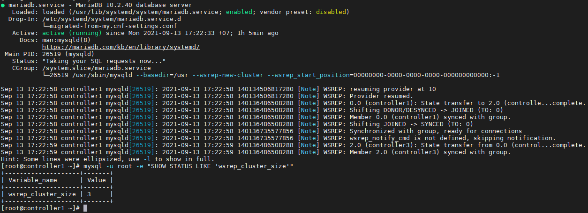
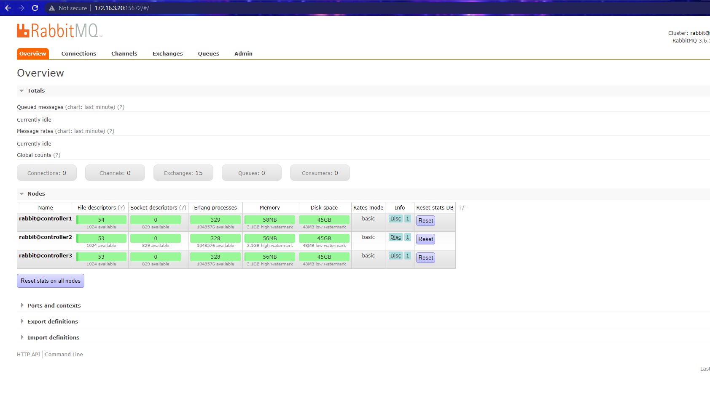
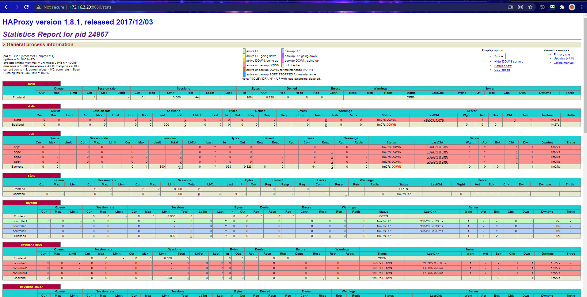

# Cài đặt High Availability - Rabbit MQ

## Phần 1. Cấu hình Galera MariaDB

Cấu hình trên 3 Node Controller

### 1. Cấu hình ban đầu

Thực hiện trên 3 node Controller (bước này có thể thao tác trên 2 node Compute luôn):

- Đặt Hosts:

```
echo "172.16.3.20 controller1" >> /etc/hosts
echo "172.16.3.21 controller2" >> /etc/hosts
echo "172.16.3.22 controller3" >> /etc/hosts
echo "172.16.3.23 compute1" >> /etc/hosts
echo "172.16.3.24 compute2" >> /etc/hosts
```

- Tắt `Firewalld`, `Network Manager`, `SElinux`:

```
sudo systemctl disable firewalld
sudo systemctl stop firewalld
sudo systemctl disable NetworkManager
sudo systemctl stop NetworkManager
sudo systemctl enable network
sudo systemctl start network
sed -i 's/SELINUX=enforcing/SELINUX=disabled/g' /etc/sysconfig/selinux
sed -i 's/SELINUX=enforcing/SELINUX=disabled/g' /etc/selinux/config
```

- Update OS:

```
yum install epel-release -y
yum update -y
```

- Cài đặt `chrony`:

```
yum install chrony -y 

systemctl start chronyd 
systemctl enable chronyd
systemctl restart chronyd 

chronyc sources -v
```

```
sudo date -s "$(wget -qSO- --max-redirect=0 google.com 2>&1 | grep Date: | cut -d' ' -f5-8)Z"
ln -f -s /usr/share/zoneinfo/Asia/Ho_Chi_Minh /etc/localtime
```

- Chuẩn bị sysctl:

```
echo 'net.ipv4.conf.all.arp_ignore = 1'  >> /etc/sysctl.conf
echo 'net.ipv4.conf.all.arp_announce = 2'  >> /etc/sysctl.conf
echo 'net.ipv4.conf.all.rp_filter = 2'  >> /etc/sysctl.conf
echo 'net.netfilter.nf_conntrack_tcp_be_liberal = 1'  >> /etc/sysctl.conf

cat << EOF >> /etc/sysctl.conf
net.ipv4.ip_nonlocal_bind = 1
net.ipv4.tcp_keepalive_time = 6
net.ipv4.tcp_keepalive_intvl = 3
net.ipv4.tcp_keepalive_probes = 6
net.ipv4.ip_forward = 1
net.ipv4.conf.all.rp_filter = 0
net.ipv4.conf.default.rp_filter = 0
EOF

sysctl -p
```

- Tạo SSH key và copy sang các node:

```
ssh-keygen -t rsa -f /root/.ssh/id_rsa -q -P ""
ssh-copy-id -o StrictHostKeyChecking=no -i /root/.ssh/id_rsa.pub root@controller2
ssh-copy-id -o StrictHostKeyChecking=no -i /root/.ssh/id_rsa.pub root@controller3
ssh-copy-id -o StrictHostKeyChecking=no -i /root/.ssh/id_rsa.pub root@compute1
ssh-copy-id -o StrictHostKeyChecking=no -i /root/.ssh/id_rsa.pub root@compute2
ssh-copy-id -o StrictHostKeyChecking=no -i /root/.ssh/id_rsa.pub root@controller1
scp /root/.ssh/id_rsa root@controller2:/root/.ssh/
scp /root/.ssh/id_rsa root@controller3:/root/.ssh/
scp /root/.ssh/id_rsa root@compute1:/root/.ssh/
scp /root/.ssh/id_rsa root@compute2:/root/.ssh/
```

- Reboot lại Server:

```
init 6
```

### 2. Cài đặt MariaDB

- Khai báo Repo để cài đặt:

```
echo '[mariadb]
name = MariaDB
baseurl = http://yum.mariadb.org/10.2/centos7-amd64
gpgkey=https://yum.mariadb.org/RPM-GPG-KEY-MariaDB
gpgcheck=1' >> /etc/yum.repos.d/MariaDB.repo
yum -y update
```

- Cài đặt MariaDB:

```
yum install -y mariadb mariadb-server
```

- Cài đặt Galera và các gói hỗ trợ:

```
yum install -y galera rsync
```

- Stop MariaDB. **Lưu ý:** Không khởi động dịch vụ mariadb sau khi cài (Liên quan tới cấu hình Galera Mariadb)

### 3. Cấu hình Galera Cluster

- Node 1:

```
echo '[server]
[mysqld]
bind-address=172.16.3.20

[galera]
wsrep_on=ON
wsrep_provider=/usr/lib64/galera/libgalera_smm.so
#add your node ips here
wsrep_cluster_address="gcomm://10.10.41.20,10.10.41.21,10.10.41.22"
binlog_format=row
default_storage_engine=InnoDB
innodb_autoinc_lock_mode=2
#Cluster name
wsrep_cluster_name="db_cluster"
# Allow server to accept connections on all interfaces.
bind-address=172.16.3.20
# this server ip, change for each server
wsrep_node_address="10.10.41.20"
# this server name, change for each server
wsrep_node_name="node1"
wsrep_sst_method=rsync
[embedded]
[mariadb]
[mariadb-10.2]
' > /etc/my.cnf.d/server.cnf
```

#### Node 2 và Node 3

Cấu hình tương ứng Node 1, Lưu ý thay thế các tham số theo đúng IP và Hostname của Node đó.

#### Khởi động lại MariaDB

- Tại Node 1:

```
galera_new_cluster
systemctl start mariadb
systemctl enable mariadb
```

- Tại Node 2 và Node 3:

```
systemctl start mariadb
systemctl enable mariadb
```

- Kiểm tra trạng thái tại Node 1:



- Đặt mật khẩu xác thực Root:

```
password_galera_root=013279227Anh
cat << EOF | mysql -uroot
GRANT ALL PRIVILEGES ON *.* TO 'root'@'%' IDENTIFIED BY '$password_galera_root';FLUSH PRIVILEGES;
GRANT ALL PRIVILEGES ON *.* TO 'root'@'localhost' IDENTIFIED BY '$password_galera_root';FLUSH PRIVILEGES;
GRANT ALL PRIVILEGES ON *.* TO 'root'@'172.16.3.20' IDENTIFIED BY '$password_galera_root';FLUSH PRIVILEGES;
GRANT ALL PRIVILEGES ON *.* TO 'root'@'172.16.3.21' IDENTIFIED BY '$password_galera_root';FLUSH PRIVILEGES;
GRANT ALL PRIVILEGES ON *.* TO 'root'@'172.16.3.22' IDENTIFIED BY '$password_galera_root';FLUSH PRIVILEGES;
GRANT ALL PRIVILEGES ON *.* TO 'root'@'127.0.0.1' IDENTIFIED BY '$password_galera_root';FLUSH PRIVILEGES;

GRANT ALL PRIVILEGES ON *.* TO 'root'@'controller1' IDENTIFIED BY '$password_galera_root';FLUSH PRIVILEGES;
GRANT ALL PRIVILEGES ON *.* TO 'root'@'controller2' IDENTIFIED BY '$password_galera_root';FLUSH PRIVILEGES;
GRANT ALL PRIVILEGES ON *.* TO 'root'@'controller3' IDENTIFIED BY '$password_galera_root';FLUSH PRIVILEGES;
EOF
```

### 4. Cấu hình cho haproxy check mysql

```
yum install rsync xinetd crudini git -y
git clone https://github.com/thaonguyenvan/percona-clustercheck
cp percona-clustercheck/clustercheck /usr/local/bin

cat << EOF >> /etc/xinetd.d/mysqlchk
service mysqlchk
{
      disable = no
      flags = REUSE
      socket_type = stream
      port = 9200
      wait = no
      user = nobody
      server = /usr/local/bin/clustercheck
      log_on_failure += USERID
      only_from = 0.0.0.0/0
      per_source = UNLIMITED
}
EOF
```

- Tạo service

```
echo 'mysqlchk 9200/tcp # MySQL check' >> /etc/services
```

- Tạo tài khoản check mysql

```
mysql -uroot -p013279227Anh
GRANT PROCESS ON *.* TO 'clustercheckuser'@'localhost' IDENTIFIED BY 'clustercheckpassword!';
FLUSH PRIVILEGES;
EXIT
```

- Bật xinetd

```
systemctl start xinetd
systemctl enable xinetd
```

- Kết quả:

```
[root@controller1 ~]# clustercheck
HTTP/1.1 200 OK
Content-Type: text/plain
Connection: close
Content-Length: 40

Percona XtraDB Cluster Node is synced.
```

- Cài đặt Plugins tương tự trên 2 node controller2 và controller3. **Lưu ý:** Bỏ qua phần tạo tài khoản mysql check vì 3 đã cài đặt Galera.

## Phần 2. Triển khai RabbitMQ Cluster

### Cài đặt các gói cần thiết

Thực hiện trên tất cả các node controller

```
yum -y install erlang socat wget

wget https://github.com/rabbitmq/rabbitmq-server/releases/download/rabbitmq_v3_6_10/rabbitmq-server-3.6.10-1.el7.noarch.rpm
rpm --import https://www.rabbitmq.com/rabbitmq-release-signing-key.asc
rpm -Uvh rabbitmq-server-3.6.10-1.el7.noarch.rpm
```

- Khởi động Dịch vụ:

```
systemctl start rabbitmq-server
systemctl enable rabbitmq-server
systemctl status rabbitmq-server
```

### Cấu hình trên node controller1

- Kiểm tra trạng thái node:

```
sudo rabbitmqctl status|grep rabbit
```

- Tạo User cho App (nhcluster), phân quyền:

```
rabbitmqctl add_user admin 013279227Anh //Tạo user admin/013279227Anh
rabbitmqctl set_user_tags admin administrator //Phân quyền administrator
rabbitmqctl add_vhost admin_vhost
rabbitmqctl set_permissions -p admin_vhost admin ".*" ".*" ".*"
```

- Copy file `/var/lib/rabbitmq/.erlang.cookie` từ `controller1` sang các node `controller2` và `controller3`

```
scp /var/lib/rabbitmq/.erlang.cookie root@controller2:/var/lib/rabbitmq/.erlang.cookie

scp /var/lib/rabbitmq/.erlang.cookie root@controller3:/var/lib/rabbitmq/.erlang.cookie
```

- Kiểm tra trạng thái cluster:

```
rabbitmqctl cluster_status
```

```
[root@controller1 ~]# rabbitmqctl cluster_status
Cluster status of node rabbit@controller1
[{nodes,[{disc,[rabbit@controller1]}]},
 {running_nodes,[rabbit@controller1]},
 {cluster_name,<<"rabbit@controller1">>},
 {partitions,[]},
 {alarms,[{rabbit@controller1,[]}]}]
```

### Thực hiện trên node controller2 và controller3

- Phân quyền file `/var/lib/rabbitmq/.erlang.cookie`

```
chown rabbitmq:rabbitmq /var/lib/rabbitmq/.erlang.cookie
chmod 400 /var/lib/rabbitmq/.erlang.cookie
```

- Khởi động lại Dịch vụ:

```
systemctl restart rabbitmq-server.service
```

- Join cluster `controller1`:

```
rabbitmqctl stop_app
rabbitmqctl join_cluster rabbit@controller1
rabbitmqctl start_app
```

### Kiểm tra trên tất cả các node

```
[root@controller1 ~]# rabbitmqctl cluster_status
Cluster status of node rabbit@controller1
[{nodes,[{disc,[rabbit@controller1,rabbit@controller2,rabbit@controller3]}]},
 {running_nodes,[rabbit@controller3,rabbit@controller2,rabbit@controller1]},
 {cluster_name,<<"rabbit@controller1">>},
 {partitions,[]},
 {alarms,[{rabbit@controller3,[]},
          {rabbit@controller2,[]},
          {rabbit@controller1,[]}]}]
```

```
[root@controller2 ~]# rabbitmqctl cluster_status
Cluster status of node rabbit@controller2
[{nodes,[{disc,[rabbit@controller1,rabbit@controller2,rabbit@controller3]}]},
 {running_nodes,[rabbit@controller3,rabbit@controller1,rabbit@controller2]},
 {cluster_name,<<"rabbit@controller1">>},
 {partitions,[]},
 {alarms,[{rabbit@controller3,[]},
          {rabbit@controller1,[]},
          {rabbit@controller2,[]}]}]
```

```
[root@controller3 ~]# rabbitmqctl cluster_status
Cluster status of node rabbit@controller3
[{nodes,[{disc,[rabbit@controller1,rabbit@controller2,rabbit@controller3]}]},
 {running_nodes,[rabbit@controller1,rabbit@controller2,rabbit@controller3]},
 {cluster_name,<<"rabbit@controller1">>},
 {partitions,[]},
 {alarms,[{rabbit@controller1,[]},
          {rabbit@controller2,[]},
          {rabbit@controller3,[]}]}]
```

### Kích hoạt plugin rabbit management

- Thực hiện trên tất cả các Node

```
rabbitmq-plugins enable rabbitmq_management
chown -R rabbitmq:rabbitmq /var/lib/rabbitmq
```

- Kiểm tra truy cập:

```
http://IP:15672
```

Tài khoản đã tạo ở trên: admin / 013279227Anh



## Phần 3. Triển khai HA Proxy - Pacemaker

### 3.1. Chuẩn bị môi trường (Trên tất cả các node)

```
yum install pacemaker corosync pcs fence-agents-all resource-agents psmisc policycoreutils-python -y
```

```
echo 013279227Anh | passwd --stdin hacluster
systemctl enable pcsd.service pacemaker.service corosync.service haproxy.service
systemctl start pcsd.service
```

- Cài đặt HA Proxy bản 1.8:

```
sudo yum install wget socat -y
wget http://cbs.centos.org/kojifiles/packages/haproxy/1.8.1/5.el7/x86_64/haproxy18-1.8.1-5.el7.x86_64.rpm 
yum install haproxy18-1.8.1-5.el7.x86_64.rpm -y
```

### 3.2. Cấu hình Cluster

Thực hiện trên node `controller1`

Ở bước này ta đặt IP Vip là `172.16.3.29`

```
pcs cluster auth controller1 controller2 controller3 -u hacluster -p 013279227Anh
pcs cluster setup --name ha_cluster controller1 controller2 controller3

pcs cluster enable --all
pcs cluster start --all

pcs property set stonith-enabled=false
pcs property set no-quorum-policy=ignore
pcs property set default-resource-stickiness="INFINITY"

pcs resource create vip_public ocf:heartbeat:IPaddr2 ip=172.16.3.29 cidr_netmask=20 \
meta migration-threshold=3 failure-timeout=60 resource-stickiness=1 \
op monitor interval=5 timeout=20 \
op start interval=0 timeout=30 \
op stop interval=0 timeout=30

pcs resource create p_haproxy systemd:haproxy \
	meta migration-threshold=3 failure-timeout=120 target-role=Started \
	op monitor interval=30 timeout=60 \
	op start interval=0 timeout=60 \
	op stop interval=0 timeout=60   

pcs constraint colocation add vip_public with p_haproxy score=INFINITY
pcs constraint order start vip_public then start p_haproxy
```

### 3.3. Cấu hình HA Proxy

Cấu hình trên cả 3 node controller

```
cp /etc/haproxy/haproxy.cfg /etc/haproxy/haproxy.cfg.org 
rm -rf /etc/haproxy/haproxy.cfg
```

```
cat >> /etc/haproxy/haproxy.cfg << EOF
global
    daemon
    group  haproxy
    log  /dev/log local0
    log /dev/log    local1 notice
    maxconn  16000
    pidfile  /var/run/haproxy.pid
    stats  socket /var/lib/haproxy/stats
    tune.bufsize  32768
    tune.maxrewrite  1024
    user  haproxy

  
defaults
    log  global
    maxconn  8000
    mode  http
    option  redispatch
    option  http-server-close
    option  splice-auto
    retries  3
    timeout  http-request 20s
    timeout  queue 1m
    timeout  connect 10s
    timeout  client 1m
    timeout  server 1m
    timeout  check 10s

listen stats
    bind 172.16.3.29:8080
    mode http
    stats enable
    stats uri /stats
    stats realm HAProxy\ Statistics

listen mysqld 
    bind 172.16.3.29:3306
    balance  leastconn
    mode  tcp
    option  httpchk
    option  tcplog
    option  clitcpka
    option  srvtcpka
    timeout client  28801s
    timeout server  28801s    
    server controller1 172.16.3.20:3306 check port 9200 inter 5s fastinter 2s rise 3 fall 3 
    server controller2 172.16.3.21:3306 check port 9200 inter 5s fastinter 2s rise 3 fall 3 backup
    server controller3 172.16.3.22:3306 check port 9200 inter 5s fastinter 2s rise 3 fall 3 backup


listen keystone-5000
    bind 172.16.3.29:5000 
    option  httpchk
    option  httplog
    option  httpclose
    balance source
    server controller1 172.16.3.20:5000  check inter 5s fastinter 2s downinter 2s rise 3 fall 3
    server controller2 172.16.3.21:5000  check inter 5s fastinter 2s downinter 2s rise 3 fall 3
    server controller3 172.16.3.22:5000  check inter 5s fastinter 2s downinter 2s rise 3 fall 3

listen keystone-35357
    bind 172.16.3.29:35357
    option  httpchk
    option  httplog
    option  httpclose
    balance source
    server controller1 172.16.3.20:35357  check inter 5s fastinter 2s downinter 2s rise 3 fall 3
    server controller2 172.16.3.21:35357  check inter 5s fastinter 2s downinter 2s rise 3 fall 3
    server controller3 172.16.3.22:35357  check inter 5s fastinter 2s downinter 2s rise 3 fall 3


listen nova-api-8774
    bind 172.16.3.29:8774 
    option  httpchk
    option  httplog
    option  httpclose
    timeout server  600s
    server controller1 172.16.3.20:8774  check inter 5s fastinter 2s downinter 3s rise 3 fall 3
    server controller2 172.16.3.21:8774  check inter 5s fastinter 2s downinter 3s rise 3 fall 3
    server controller3 172.16.3.22:8774  check inter 5s fastinter 2s downinter 3s rise 3 fall 3

listen nova-metadata-api
    bind 172.16.3.29:8775 
    option  httpchk
    option  httplog
    option  httpclose
    server controller1 172.16.3.20:8775  check inter 5s fastinter 2s downinter 3s rise 3 fall 3
    server controller2 172.16.3.21:8775  check inter 5s fastinter 2s downinter 3s rise 3 fall 3
    server controller3 172.16.3.22:8775  check inter 5s fastinter 2s downinter 3s rise 3 fall 3

listen nova-novncproxy
	bind 172.16.3.29:6080
    balance  source
    option  httplog
    server controller1 172.16.3.20:6080  check
    server controller2 172.16.3.21:6080  check
    server controller3 172.16.3.22:6080  check
    
listen nova_placement_api
    bind 172.16.3.29:8778
    balance source
    option tcpka
    option tcplog
    http-request del-header X-Forwarded-Proto
    server controller1 172.16.3.20:8778 check inter 2000 rise 2 fall 5
    server controller2 172.16.3.21:8778 check inter 2000 rise 2 fall 5
    server controller3 172.16.3.22:8778 check inter 2000 rise 2 fall 5    
    
listen glance-api
    bind 172.16.3.29:9292
    option  httpchk /versions
    option  httplog
    option  httpclose
    timeout server  11m
    server controller1 172.16.3.20:9292  check inter 5s fastinter 2s downinter 3s rise 3 fall 3
    server controller2 172.16.3.21:9292  check inter 5s fastinter 2s downinter 3s rise 3 fall 3
    server controller3 172.16.3.22:9292  check inter 5s fastinter 2s downinter 3s rise 3 fall 3

listen glance-registry
    bind 172.16.3.29:9191 
    timeout server  11m
    server controller1 172.16.3.20:9191  check
    server controller2 172.16.3.21:9191  check
    server controller3 172.16.3.22:9191  check

listen neutron
    bind 172.16.3.29:9696 
    option  httpchk
    option  httplog
    option  httpclose
    balance source
    server controller1 172.16.3.20:9696  check inter 5s fastinter 2s downinter 3s rise 3 fall 3
    server controller2 172.16.3.21:9696  check inter 5s fastinter 2s downinter 3s rise 3 fall 3
    server controller3 172.16.3.22:9696  check inter 5s fastinter 2s downinter 3s rise 3 fall 3

listen cinder-api
    bind 172.16.3.29:8776 
    option  httpchk
    option  httplog
    option  httpclose
    server controller1 172.16.3.20:8776  check inter 5s fastinter 2s downinter 3s rise 3 fall 3
    server controller2 172.16.3.21:8776 backup check inter 5s fastinter 2s downinter 3s rise 3 fall 3
    server controller3 172.16.3.22:8776 backup check inter 5s fastinter 2s downinter 3s rise 3 fall 3

  
listen horizon
    bind 172.16.3.29:80
    balance  source
    mode  http
    option  forwardfor
    option  httpchk
    option  httpclose
    option  httplog
    stick  on src
    stick-table  type ip size 200k expire 30m
    timeout  client 3h
    timeout  server 3h
    server controller1 172.16.3.20:80  weight 1 check
    server controller2 172.16.3.21:80  weight 1 check
    server controller3 172.16.3.22:80  weight 1 check
EOF
```

- Sau khi cấu hình HAProxy xong trên tất cả các node thực hiện lệnh trên `controller1`:

```
pcs resource restart p_haproxy
pcs resource cleanup
```

```
[root@controller1 ~]# pcs resource show --full
 Resource: vip_public (class=ocf provider=heartbeat type=IPaddr2)
  Attributes: cidr_netmask=24 ip=172.16.3.29
  Meta Attrs: failure-timeout=60 migration-threshold=3 resource-stickiness=1
  Operations: monitor interval=5 timeout=20 (vip_public-monitor-interval-5)
              start interval=0 timeout=30 (vip_public-start-interval-0)
              stop interval=0 timeout=30 (vip_public-stop-interval-0)
 Resource: p_haproxy (class=systemd type=haproxy)
  Meta Attrs: failure-timeout=120 migration-threshold=3 target-role=Started
  Operations: monitor interval=30 timeout=60 (p_haproxy-monitor-interval-30)
              start interval=0 timeout=60 (p_haproxy-start-interval-0)
              stop interval=0 timeout=60 (p_haproxy-stop-interval-0)
```

- Truy cập vào IP VIP theo link `http://172.16.3.29:8080/stats` để kiểm tra:



## Phần 4. Cài đặt các gói cần thiết cho OPS (Trên tất cả các node)

- Cài đặt các gói cần thiết:

```
yum -y install centos-release-openstack-queens
yum -y install crudini wget vim
yum -y install python-openstackclient openstack-selinux python2-PyMySQL
```

- Cài đặt Memcache

**Lưu ý:** Cấu hình tương ứng với IP của node controller

```
yum install -y memcached

sed -i "s/-l 127.0.0.1,::1/-l 172.16.3.20/g" /etc/sysconfig/memcached

systemctl enable memcached.service
systemctl restart memcached.service
```

## Phần 5. Cài đặt Keystone

### 5.1 Tạo Database

Thực hiện trên node `controller1`

```
mysql -u root -p013279227Anh
CREATE DATABASE keystone;
GRANT ALL PRIVILEGES ON keystone.* TO 'keystone'@'localhost' \
IDENTIFIED BY '013279227Anh';
GRANT ALL PRIVILEGES ON keystone.* TO 'keystone'@'%' \
IDENTIFIED BY '013279227Anh';

GRANT ALL PRIVILEGES ON keystone.* TO 'keystone'@'controller1' IDENTIFIED BY '013279227Anh';FLUSH PRIVILEGES;
GRANT ALL PRIVILEGES ON keystone.* TO 'keystone'@'controller2' IDENTIFIED BY '013279227Anh';FLUSH PRIVILEGES;
GRANT ALL PRIVILEGES ON keystone.* TO 'keystone'@'controller3' IDENTIFIED BY '013279227Anh';FLUSH PRIVILEGES;
exit
```

### 5.2. Cài đặt các gói cần thiết

Thực hiện trên tất cả các node:

