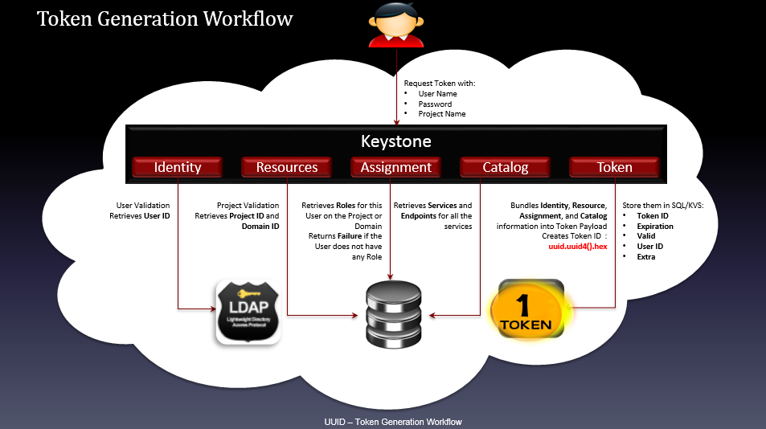
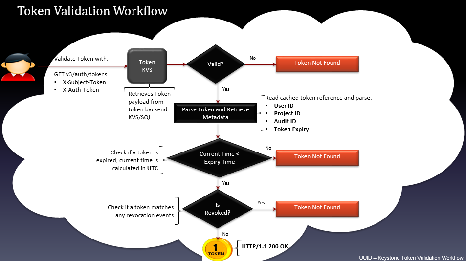
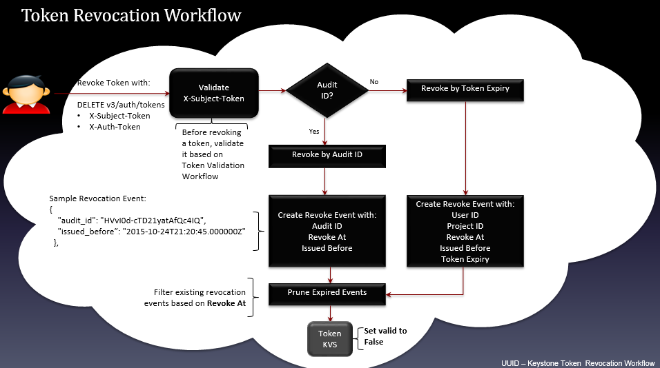
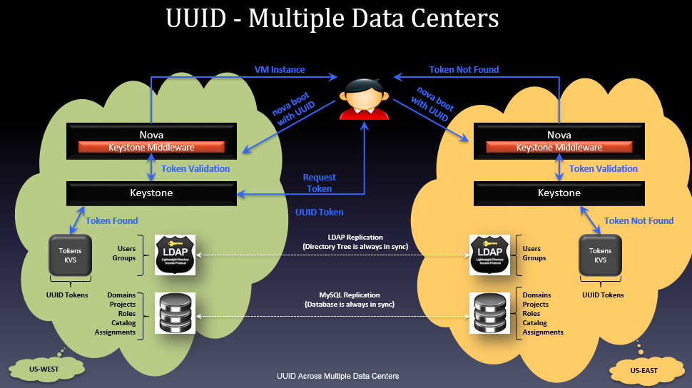
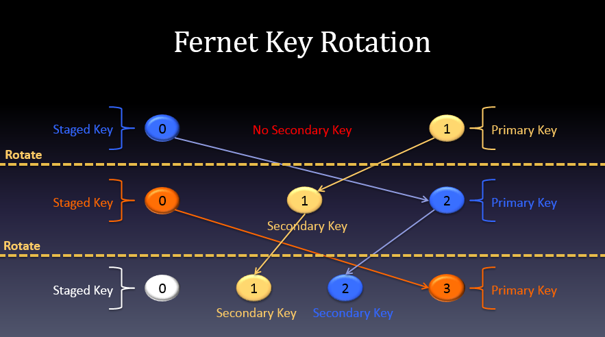

# Các loại Token trong Keystone

## Một số khái niệm

**Payload (dịch: khối hàng)**: Payload là phần dữ liệu vận chuyển của một gói tin giữa 2 đối tác, mà không chứa dữ liệu giao thức hay siêu dữ liệu chỉ được gửi đi để dùng cho việc chuyên chở payload. Payload thường là văn bản, dấu hiệu hay âm thanh. Payload thường nằm dưới phần đầu (header), và tùy theo giao thức mạng có thể có thêm phần cuối (trailer).

## Phần 1. Lịch sử token trong OpenStack

Vào những ngày đầu, Keystone hỗ trợ UUID token. Đây là loại token gồm 32 kí tự được dùng để xác thực và ủy quyền. Lợi ích mà loại token này mang lại đó là nó nhỏ gọn và dễ sử dụng, nó có thể được thêm trực tiếp vào câu lệnh cURL. Tuy nhiên nó lại không thể chứa đủ thông tin để thực hiện việc ủy quyền. Các services của OpenStack sẽ luôn phải gửi lại token này lại cho Keystone để xác thực xem hành động có hợp lệ không. Điều này khiến Keystone trở thành trung tâm cho mọi hoạt động của OpenStack.

Trong nỗ lực kiếm tìm một loại token mới để khắc phục những nhược điểm của UUID token, nhóm phát triển đã tạo ra PKI token. Token này chứa đủ thông tin để xác thực và ủy quyền và đồng thời nó cũng chứa cả danh mục dịch vụ. Bên cạnh đó, token này được gán vào và các dịch vụ có thể cache lại nó để dử dụng cho đến khi nó hết hiệu lực hoặc bị hủy. Loại token này vì thế cũng khiến lượng traffic tới Keystone server ít hơn. Tuy nhiên kích cỡ của nó có thể lên tới 8k và điều này làm việc gán vào HTTP header trở nên khó khăn hơn. Rất nhiều các web server mặc định sẽ không cho phép điều này nếu chưa được config lại. Thêm vào đó, loại token này cũng rất khó được sử dụng trong câu lệnh cURL. Vì những hạn chế mà các nhà phát triển đã cố gắng sửa đổi và ra mắt một phiên bản khác đó là PKIz, tuy nhiên theo đánh giá của cộng đồng thì loại token này vẫn rất lớn về kích thước.

Điều này buộc Keystone team phải đưa ra một loại mới và đó là Fernet token. Fernet token khá nhỏ (255 kí tự) tuy nhiên nó lại chưa đủ thông tin để ủy quyền. Bên cạnh đó, việc nó chứa đủ thông tin cũng không khiến token database phải lưu dữ liệu token nữa. Các nhà vận hành thường phải dọn dẹp Keystone token database để hệ thống của họ hoạt động ổn định. Mặc dù vậy, Fernet token có nhược điểm đó là symmetric keys được dùng để tạo ra token cần được phân phối và xoay vòng. Các nhà vận hành cần phải giải quyết vấn đề này, tuy nhiên họ có vẻ thích thú với việc này hơn là sử dụng những loại token khác.

## Phần 2. Các loại token

### 1. UUID

- UUID là viết tắt của Universally Unique IDentifier, hiểu nôm na là một định danh duy nhất.
A UUID is a 16-octet (128-bit) number.

- UUID được đại diện bởi 32 chữ số thập lục phân,hiển thị trong năm nhóm, phân cách bằng dấu gạch nối, với dạng 8-4-4-4-12. Có tổng cộng 36 ký tự, trong đó 32 ký tự chữ với 4 dấu gạch ngang.

- UUID có 5 phiên bản, trong đó keystone sử dụng UUIDv4.

#### Đặc điểm UUID trong keystone:

- Có độ dài 32 byte, nhỏ, dễ sử dụng, không nén.

- Không mang theo đủ thông tin, nó chỉ đơn giản là định danh khóa chiếu đến 1 bảng trong db keystone.

- Được lưu vào database.

- Sử dụng thời gian dài làm giảm hiệu suất hoạt động, CPU tăng và thời gian đáp ứng lâu.

- Sử dụng câu lệnh keystone-manager token flush để làm tăng hiệu suất hoạt động.

#### Ưu nhược điểm

**Ưu điểm:**

- Phương pháp tạo token đơn giản

- Khuyến cao cho mỗi trường phát triển.

**Nhược điểm:**

- Token cố định.

- Không linh hoạt khi triển khai Multi OpenStack.

**Method dùng để sinh ra UUID token:**

```
def _get_token_id(self, token_data):
 return uuid.uuid4().hex
```

#### Token Generation Workflow (Quá trình tạo token)



- User request tới keystone tạo token với các thông tin: user name, password, project name

- Chứng thực user, lấy User ID từ backend LDAP (dịch vụ Identity)

- Chứng thực project, thu thập thông tin Project ID và Domain ID từ Backend SQL (dịch vụ Resources)

- Lấy ra Roles từ Backend trên Project hoặc Domain tương ứng trả về cho user, nếu user không có bất kỳ roles nào thì trả về Failure(dịch vụ Assignment)

- Thu thập các Services và các Endpoints của các service đó (dịch vụ Catalog)

- Tổng hợp các thông tin về Identity, Resources, Assignment, Catalog ở trên đưa vào Token payload, tạo ra token sử dụng hàm `uuid.uuid4().hex`

- Lưu thông tin của Token vào SQL/KVS backend với các thông tin: `TokenID`, `Expiration`, `Valid`, `UserID`, `Extra`.

#### Token Validation Workflow (Quá trình xác thực token)



- Gửi yêu cầu chứng thực token sử dụng API: GET v3/auth/tokens và token (X-Subject-Token, X-Auth-Token).

- Thu thập token payloads từ token backend KVS/SQL kiểm tra trường valid. Nếu không hợp lệ trả về thông báo Token Not Found. Nếu tìm thấy chuyển sang bước tiếp theo.

- Phân tích token và thu thập metadata: User ID, Project ID, Audit ID, Token Expire.

- Kiểm tra token đã expired chưa. Nếu thời điểm hiện tại < "expired time" theo UTC thì token chưa expired, chuyển sang bước tiếp theo, ngược lại trả về thông báo token not found.

- Kiểm tra xem token đã bị thu hồi chưa (kiểm tra trong bảng revocation_event của database keystone).

- Nếu token đã bị thu hồi (tương ứng với 1 event trong bảng revocation_event) trả về thông báo Token Not Found. Nếu chưa bị thu hồi trả về token (truy vấn HTTP thành công HTTP/1.1 200 OK).

#### Token Revocation Workflow (Quá trình thu hồi token)



- Gửi yêu cầu thu hồi token với API request DELETE v3/auth/tokens. Trước khi thực hiện sự kiện thu hồi token thì phải chứng thực token nhờ vào tiến trình Token Validation Workflow đã trình bày ở trên.

- Kiểm tra trường Audit ID. Nếu có, tạo sự kiện thu hồi với audit id. Nếu không có audit id, tạo sự kiện thu hồi với token expired.

- Nếu tạo sự kiện thu hồi token với audit ID, các thông tin cần cập nhật vào revocation_event table của keystone database gồm: audit_id, revoke_at, issued_before.

- Nếu tạo sự kiện thu hồi token với token expired, các thông tin cần thiết cập nhật vào revocation_event table của keystone database gồm: user_id, project_id, revoke_at, issued_before, token_expired.

- Loại bỏ các sự kiện của các token đã expired từ bảng revocation_event của database "keystone" Cập nhật vào token database, thiết lập lại trường "valid" thành false (0)

#### Multiple Data Centers



UUID Token không hỗ trợ xác thực và ủy quyền trong trường hợp multiple data centers bởi token được lưu dưới dạng persistent (cố định và không thể thay đổi). Như ví dụ mô tả ở hình trên, một hệ thống cloud triển khai trên hai datacenter ở hai nơi khác nhau. Khi xác thực với keystone trên datacenter W và sử dụng token trả về để request tạo một máy ảo với Nova, yêu cầu hoàn toàn hợp lệ và khởi tạo máy ảo thành công. Trong khi nếu mang token đó sang datacenter E yêu cầu tạo máy ảo thì sẽ không được xác nhận do token trong backend database W không có bản sao bên E.

### 2. PKI Token

Token này chứa một lượng khá lớn thông tin ví dụ như: thời gian nó được tạo, thời gian nó hết hiệu lực, thông tin nhận diện người dùng, project, domain, thông tin về role cho user, danh mục dịch vụ,... Tất cả các thông tin này được lưu ở trog phần payload của file định dạng JSON. Phần payload được "signed" theo chuẩn X509 và đóng gói dưới dạng cryptographic message syntax (CMS). Với PKIz thì phần payload được nén sử dụng `zlib`.

PKI Token dựa trên chữ ký điện tử. Keystone sẽ dùng private key cho việc ký nhận và các Openstack API sẽ có public key để xác thực thông tin đó.

PKI và PKIZ đã không hỗ trợ và không được dùng từ bản Ocata.

#### Đặc điểm

- Sử dụng phương pháp khóa công khai, đòi hỏi 3 loại key (key.pem, cert.pem, ca.pem)

- Chứa nhiều thông tin: thời điểm khởi tạo, thời điểm hết hạn, user id, project, domain, role gán cho user, danh mục dịch vụ nằm trong payload.

- Xác thực trực tiếp bằng token, không cần phải gửi yêu cầu xác thực đến Keystone.

- Có bộ nhớ cache, sử dụng cho đến khi hết hạn hoặc bị thu hồi => truy vấn đến keystone ít hơn.

- Kích thước lớn, chuyển token qua HTTP, sử dụng base64.

- Kích thước lớn chủ yếu do chứa thông tin service catalog.

- Tuy nhiên, Header của HTTP chỉ giới hạn 8kb. Web server không thể xử lý nếu không cấu hình lại, khó khăn hơn UUID.

- Để khắc phục lỗi trên thì phải tăng kích thước header HTTP của web server, tuy nhiên đây không phải là giải pháp cuối cùng hoặc swift có thể thiết lập không cần catalog service.

- Lưu token vào database.

#### Ưu nhược điểm

**Ưu điểm:** Xác thực không cần gọi về KeyStone, token mang thông tin về user.

**Nhược điểm:**

- Request rất nặng.

- Cấu hình phức tạp.

- Không linh hoạt trong hạ tầng lớn, không thực sự linh hoạt trong môi trường multi openstack.

### 3. Fernet Tokens

Đây là loại token mới nhất, nó được tạo ra để khắc phục những hạn chế của các loại token trước đó. Thứ nhất, nó khá nhỏ với khoảng 255 kí tự, lớn hơn UUID nhưng nhỏ hơn rất nhiều so với PKI. Token này cũng chứa vừa đủ thông tin để cho phép nó không cần phải được lưu trên database.

Fernet tokens chứa một lượng nhỏ dữ liệu ví dụ như thông tin để nhận diện người dùng, project, thời gian hết hiệu lực,...Nó được sign bởi symmetric key để ngăn ngừa việc giả mạo. Cơ chế hoạt động của loại token này giống với UUID vì thế nó cũng phải được validate bởi Keystone.

Một trong những vấn đề của loại token này đó là nó dùng symmetric key để mã hóa token và các keys này buộc phải được phân phối lên tất cả các region của OpenStack. Thêm vào đó, keys cũng cần được rotated.

#### Tổng quan:

- Sử dụng mã hóa đối xứng (Sử dụng chung key để mã hóa và giải mã).

- Có kích thước khoảng 255 byte, không nén, lớn hơn UUID và nhỏ hơn PKI.

- Chứa các thông tin cần thiết như userid, projectid, domainid, methods, expiresat,....Không chứa serivce catalog.

- Không lưu token vào database.

- Cần phải gửi lại keystone để xác nhận, tương tự UUID.

- Cần phải phân phối khóa cho các khu vực khác nhau trong OpenStack.

- Sử dụng cơ chế xoay khóa để tăng tính bảo mật.

- Nhanh hơn 85% so với UUID và 89% so với PKI.

#### Đặc điểm

- Fernet Keys lưu trữ trong `/etc/keystone/fernet-keys`

- Mã hóa với Primary Fernet Key

- Giải mã với danh sách các Fernet Key

#### Ưu nhược điểm

**Ưu điểm:**

- Nhẹ hơn PKI và PKIZ

- Không cần lưu trữ trong DB

- Trong token mang thông tin

- Hỗ trợ Multi OpenStack

**Nhược điểm:**

- Quá trình xác thực tăng hoạt động thu hồi

- Ví dụ 1 đoạn token:

```
gAAAAABU7roWGiCuOvgFcckec-0ytpGnMZDBLG9hA7Hr9qfvdZDHjsak39YN98HXxoYLIqVm19Egku5YR
3wyI7heVrOmPNEtmr-fIM1rtahudEdEAPM4HCiMrBmiA1Lw6SU8jc2rPLC7FK7nBCia_BGhG17NVHuQu0
S7waA306jyKNhHwUnpsBQ%3D
```

File fernet key `/etc/keystone/fernet-keys` => 0 1 2 3 4

**Các loại fernet keys:**

- Loại 1: Primary key

    - Dùng để mã hóa và giải mã

    - File name có số index cao nhất

- Loại 2: Secondary key

    - Chỉ được dùng để giải mã

    - File name có số index nằm giữa private key và staged key.

- Loại 3: Staged key

    - Giải mã và chuẩn bị để chuyển thành primary key

    - File name nhỏ nhất (0)

#### Fernet Key rotation

