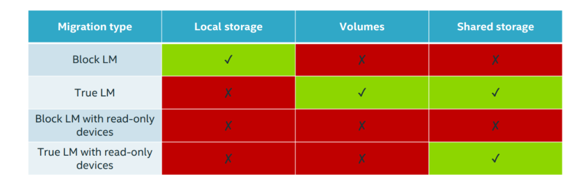
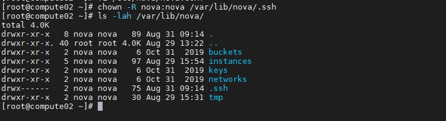
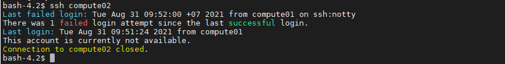
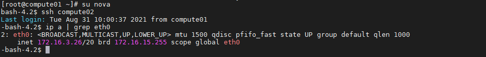

# Migrate VM trong Openstack

## Tổng quan

Migration là quá trình di chuyển máy ảo từ host vật lí này sang một host vật lí khác. Migration được sinh ra để làm nhiệm vụ bảo trì nâng cấp hệ thống. Ngày nay tính năng này đã được phát triển để thực hiện nhiều tác vụ hơn:

- **Cân bằng tải**: Di chuyển VMs tới các host khác khi phát hiện host đang chạy có dấu hiệu quá tải.

- **Bảo trì, nâng cấp hệ thống**: Di chuyển các VMs ra khỏi host trước khi tắt nó đi.

- **Khôi phục lại máy ảo khi host gặp lỗi**: Restart máy ảo trên một host khác.

Trong OpenStack, việc migrate được thực hiện giữa các node compute với nhau hoặc giữa các project trên cùng 1 node compute.

Openstack cung cấp 1 số phương pháp khác nhau đề Migrate VM. Các phương pháp này có các hạn chế khác nhau:

- Không thể live-migrate với shared storage.

- Không thể live-migrate nếu đã bật enabled.

- Không thể select target host nếu sử dụng nova migrate.

**Opensatck hỗ trợ hai kiểu migration đó là:**
- Cold migration: Non-live migration

- Live migration:

    - True live migration (shared storage or volume-based)

    - Block live migration

## So sánh 2 kiểu migrate

### Cold migrate

**Ưu điểm:**

- Đơn giản, dễ thực hiện

- Thực hiện được với mọi loại máy ảo

**Nhược điểm:**

- Thời gian downtime lớn

- Không thể chọn host muốn migrate đến

- Quá trình migrate có thể mất một khoảng thời gian dài.

### Live migrate

**Ưu điểm:**

- Có thể chọn host muốn migrate đến

- Tiết kiệm chi phí, tăng sự linh hoạt trong khâu quản lý và vận hành

- Giảm thời gian downtime và gia tăng khả năng "cứu hộ" khi gặp sự cố.

**Nhược điểm:**

- Dù chọn được host nhưng vẫn có những giới hạn nhất định

- Quá trình migrate có thể fails nếu host bạn chọn không có đủ tài nguyên.

- Bạn không được can thiệp vào bất cứ tiến trình nào trong quá trình live migrate.

- Khó migrate với những máy ảo có dung lượng bộ nhớ lớn và trường hợp hai host khác CPU.

## Workflow 

### Cold migrate 

1. Tắt máy ảo (giống với virsh destroy) và ngắt kết nối với volume.

2. Di chuyển thư mục hiện tại của máy ảo (instance_dir -> instance_dir_resize).

3. Nếu sử dụng QCOW2 với backing files (chế độ mặc định) thì image sẽ được convert thành dạng flat.

4. Với shared storage, di chuyển thư mục chứa máy ảo. Nếu không, copy toàn bộ thông qua SCP.

### Live migrate

1. Kiểm tra lại xem storage backend có phù hợp với loại migrate sử dụng không

    - Thực hiện check shared storage với chế độ migrate thông thường

    - Không check khi sử dụng block migrations

    - Việc kiểm tra thực hiện trên cả 2 node gửi và nhận, chúng được điều phối bởi RPC call từ scheduler.

2. Đối với nơi nhận

    - Tạo các kết nối càn thiết với volume.

    - Nếu dùng block migration, tạo thêm thư mục chứa máy ảo, truyền vào đó những backing files còn thiếu từ Glance và tạo disk trống.

3. Tại nơi gửi, bắt đầu quá trình migration (qua url)

4. Khi hoàn thành, generate lại file XML và define lại nó ở nơi chứa máy ảo mới.

Trong live-migrate có hai loại là True và Block live migration. Dưới đây là mô tả một số các loại storage hỗ trợ hai loại migration này:



## Hướng dẫn cấu hình 2 loại migrate

### Cold migrate

Thực hiện migrate 1 VM từ `compute01`(172.16.3.25) sang `compute02`(172.16.3.26)

> ### Sử dụng SSH Tunneling để migrate hoặc resize VM

### Tại node Compute01

Sử dụng khóa gốc có trong thư mục `/root/.ssh/id_rsa` và `/root/.ssh/id_rsa.pub` hoặc tạo cặp khóa mới. Ở đây, ta sẽ tạo khóa mới

- Tạo `usermode`

```
usermod -s /bin/bash nova
```

- Tạo key-pair cho user `nova`:

```
su nova
ssh-keygen
echo 'StrictHostKeyChecking no' >> /var/lib/nova/.ssh/config
cat /var/lib/nova/.ssh/id_rsa.pub > /var/lib/nova/.ssh/authorized_keys
chmod 600 /var/lib/nova/.ssh/id_rsa /var/lib/nova/.ssh/authorized_keys
exit
```

Thực hiện với quyền root, scp key pair tới node `compute02`. Nhập mật khẩu khi được yêu cầu.

### Tại node Compute02

- Thay đổi quyền của key pair cho user nova và add key pair đó vào SSH:



- Kiểm tra lại từ node `compute01` để chắc chắn user `nova` login được vào node `compute02` mà không cần sử dụng password

```
su nova
ssh compute02
```



- Kiểm tra tương tự trên node `compute02`

```
su nova
ssh compute01
```

#### Lưu ý

- Nếu gặp phải lỗi:

```
This account is currently not available.
Connection to compute02 closed.
```

- Kiểm tra shell của user `nova` trên node `compute02`, ta sẽ thấy `nologin`

```
cat /etc/passwd | grep "nova"
nova:x:162:162:OpenStack Nova Daemons:/var/lib/nova:/sbin/nologin
```

- Bạn cần set usermod trên node `Compute2`

```
usermod -s /bin/bash nova
```

- Kiểm tra lại Kết nối từ `compute01` sang `compute02`:



**Lưu ý:** Đối với trường hợp nhiều node compute, có thể sử dụng chung 1 cặp key, copy cặp key đó tới tất cả các node, để tất cả các node có thể xác thực lẫn nhau.

### Thực hiện trên cả 2 node

Restart service

```
systemctl restart libvirtd.service
systemctl restart openstack-nova-compute.service
```

### Thực hiện cold-migrate - Trên node Controller

- Tắt máy ảo nếu nó đang chạy: (Nên tắt máy)

```
openstack server stop <ten_máy_ảo hoặc ID_máy_ảo>
```

Ví dụ:

```
openstack server stop Provider_VM01
```

- Migrate máy ảo:

```
openstack server migrate Provider_VM01
```

-  Kiểm tra lại trạng thái:

```
[root@controller1 ~]# openstack server list
+--------------------------------------+---------------+---------------+-----------------------+-------------+---------+
| ID                                   | Name          | Status        | Networks              | Image       | Flavor  |
+--------------------------------------+---------------+---------------+-----------------------+-------------+---------+
| ef84a284-ba8d-4980-b888-ea852d313dd3 | VM5           | ACTIVE        | provider=10.10.40.103 | cirros-ceph | m1.nano |
| e142cfbd-4417-4a21-adb3-2a21bd12254e | Provider_VM02 | ACTIVE        | provider=10.10.40.113 | cirros-ceph | m1.nano |
| e8eb7a37-1c90-4b1e-85c9-ec14fe3b6501 | Provider_VM01 | VERIFY_RESIZE | provider=10.10.40.114 | cirros-ceph | m1.nano |
+--------------------------------------+---------------+---------------+-----------------------+-------------+---------+
```

Xác thực resize:

```
openstack server resize --confirm Provider_VM01
```

Kiểm tra lại kết quả: Kiểm tra thấy Server `Provider_VM01` đã được chuyển sang node `compute02`

```
openstack server list --long
+--------------------------------------+---------------+---------+------------+-------------+-----------------------+-------------+--------------------------------------+-------------+-----------+-------------------+-----------+------------+
| ef84a284-ba8d-4980-b888-ea852d313dd3 | VM5           | ACTIVE  | None       | Running     | provider=10.10.40.103 | cirros-ceph | 9735ed16-41fb-4041-8872-2a26e828f72d | m1.nano     | 0         | nova              | compute02 |            |
| e142cfbd-4417-4a21-adb3-2a21bd12254e | Provider_VM02 | ACTIVE  | None       | Running     | provider=10.10.40.113 | cirros-ceph | 9735ed16-41fb-4041-8872-2a26e828f72d | m1.nano     | 0         | nova              | compute01 |            |
| e8eb7a37-1c90-4b1e-85c9-ec14fe3b6501 | Provider_VM01 | SHUTOFF | None       | Shutdown    | provider=10.10.40.114 | cirros-ceph | 9735ed16-41fb-4041-8872-2a26e828f72d | m1.nano     | 0         | nova              | compute02 |            |
+--------------------------------------+---------------+---------+------------+-------------+-----------------------+-------------+--------------------------------------+-------------+-----------+-------------------+-----------+------------+
```

## Hướng dẫn cấu hình Live-Migrate

**OpenStack hỗ trợ 2 loại live migrate:**

- True live migration (shared storage or volume-based) : Trong trường hợp này, máy ảo sẽ được di chuyển sửa dụng storage mà cả hai máy computes đều có thể truy cập tới. Nó yêu cầu máy ảo sử dụng block storage hoặc shared storage.

- Block live migration : Mất một khoảng thời gian lâu hơn để hoàn tất quá trình migrate bởi máy ảo được chuyển từ host này sang host khác. Tuy nhiên nó lại không yêu cầu máy ảo sử dụng hệ thống lưu trữ tập trung.

Các yêu cầu chung:

- Cả hai node nguồn và đích đều phải được đặt trên cùng subnet và có cùng loại CPU.

- Cả controller và compute đều phải phân giải được tên miền của nhau.

- Compute node buộc phải sử dụng KVM với libvirt.

**Lưu ý:** live-migration làm việc với 1 số loại VM và storage

- Shared storage: Cả 2 hypervisor có quyền truy cập shared storage chung.

- Block storage: VM sử dụng root disk, không tương thích với các loại read-only devices.

- Volume storage: VM sử dụng iSCSI volumes.

Tham khảo hướng dẫn **Hướng dẫn cấu hình Live-Migrate** [tại đây](https://github.com/danghai1996/OpenStack/blob/master/Nova/09-migrate.md#h%C6%B0%E1%BB%9Bng-d%E1%BA%ABn-c%E1%BA%A5u-h%C3%ACnh-live-migrate)

## Các nguồn tham khảo

https://docs.openstack.org/nova/train/admin/migration.html

https://docs.openstack.org/nova/train/admin/live-migration-usage.html